# Handling Sudoku puzzles with irregular learning cellular automata

Theodoros Panagiotis Chatzinikolaou1 • Rafailia-Eleni Karamani1 • Iosif-Angelos Fyrigos1 Georgios Ch. Sirakoulis1

Accepted: 1 August 2023 / Published online: 10 March 2024 - The Author(s) 2024

## Abstract

The use of Cellular Automata (CA) in combination with Learning Automata (LA) has demonstrated effectiveness in handling hard-to-be-solved problems. Due to their capacity to learn and adapt, as well as their inherent parallelism, they can expedite the problem-solving process for a range of problems, such as challenging logic puzzles. One such puzzle is Sudoku, which poses a combinatorial optimization challenge of great difficulty and complexity. In this study, a Sudoku puzzle was represented as an Irregular Learning Cellular Automaton (ILCA), using a reward and penalty algorithm to resolve it. Simulations for an amount of 400 puzzles were performed, while the results demonstrate that the proposed algorithm operates effectively, highlighting the concurrent and learning capabilities of the ILCA structure. Furthermore, two different performance enhancement methods are investigated, namely learning rates method and selective probability reset rule, which are able to increase the initial performance by 26:8% and to achieve an overall 99:3% resolution rate.

Keywords Complex logic puzzles - Sudoku - Cellular automata - Learning automata - Irregular learning cellular automata

### 1 Introduction

In the recent decades, Cellular Automata (CA) and Learning Automata (LA) have been extensively researched. CA are physical models that incorporate parallel processing computational capabilities, while LA encapsulate the adaptability of learning during evolution to make optimal decisions. Consequently, Learning Cellular Automata (LCA) combine the strengths of both CA and LA aiming to create a powerful problem-solving tool that can adapt to almost any complex environment. It can be considered as a distributed computational model (Ahangaran

et al. 2017) where global complex phenomena can emerge through the spatial interaction of simple identical units. The main characteristic that differentiates LCA from traditional CA is attributed to the adaptation of the decision process. LCA improves the behavior of its cells based on the overall system’s response, striving to provide optimal results during its evolution (Karamani et al. 2021).

At the same time, complex logic puzzles require advanced logical reasoning skills to solve. Among them, Sudoku is easily considered as the most prominent logic puzzle example of our time and one of the most popular examples among puzzle enthusiasts. A common property of many complex logic puzzles, Sudoku included, is that the solver is challenged not to only find the solution but this must be realized under the constraint that a unique solution exists. To solve Sudoku puzzles, players deduce the possible values for each cell based on the values of neighboring cells and the rules of the puzzle (Simonis 2005). The Sudoku resolution process could, also, assist in realworld problems that involve finding optimal solutions among many possibilities, such as scheduling, optimization, cryptography or protein folding (Chien and Hon 2010; Ercsey-Ravasz and Toroczkai 2012; Manikandan et al. 2021). There are different methods to solve Sudoku puzzles, such as stochastic algorithms, pattern overlay or filtering techniques (Soto et al. 2015; Weaver 2020; Jana et al. 2021). Irregular Learning Cellular Automata (ILCA) algorithms have been also identified as a good candidate for solving such kind of puzzles due to their ability to handle complex logical reasoning and adapt to changing environments (Chatzinikolaou et al. 2022).

This article explores the use of LCA-based algorithms to solve Sudoku puzzles. Taking inspiration from Chatzinikolaou et al. (2022), a simplified ILCA Sudoku resolution algorithm with reduced complexity is proposed. As a next step, its performance is analyzed on a wide range of Sudoku puzzles of varying difficulties proving that retains its resolution ability and can be applicable to challenging ones with higher difficulty, namely Evil puzzles. The proposed algorithm is, also, getting expanded with two different methods to be investigated, in particular, learning rates method and selective probability reset rule, aiming to enhance its resolution performance. The combination of these methods demonstrates higher resolution rates, reaching a 26:8% improvement from the initial one with an overall 99:3% resolution rate.

#### 2 Complex logic puzzles

A complex logic puzzle can be described as a problem that requires following specific steps to reach at one or more definite solutions. Unlike games which are won, puzzles are solved using advanced problem-solving skills and logical reasoning. Common features of logic puzzles include being designed for a single player, being governed by simple rules that guide their progression, and being solved through deduction (Hufkens and Browne 2019).

These puzzles often involve multiple steps and require a profound understanding of various logical principles, such as deductive reasoning, induction, and syllogisms. They frequently require creative thinking and the ability to identify patterns and relationships between different elements, which is the reason why they are considered valuable for helping people to improve cognitive skills such as problem-solving, critical thinking, and analytical reasoning (Brooker et al. 2019). Examples of complex logic puzzles include Sudoku, crossword puzzles, and various types of riddles and brain teasers.

#### 2.1 The Sudoku puzzle

Sudoku is a popular complex logic puzzle originated in Japan in the 1980s. It is often described as ‘‘the Rubik’s cube of the 21st century’’ (Lynce and Ouaknine 2006). The puzzle typically starts with some of the cells already filled in, and the solver must use logic and deduction to fill in the remaining cells. The rules of Sudoku are simple, but the puzzles can range in difficulty from easy to extremely challenging, depending on the number of starting clues and the complexity of the logical deductions required to solve the puzzle. Each puzzle configuration leads to a unique solution and does not require the search for the solution, meaning it is based merely on reasoning.

A standard Sudoku puzzle consists of a \(9 \times 9\) grid divided into nine 3  3 sub-grids; although other variations also exist. Each of the 81 cells in the grid can contain a number from 1 to 9. At the beginning of the puzzle, some cells have their assigned numbers pre-filled (Delahaye 2006). Figure 1a illustrates a partially completed \(9 \times 9\) Sudoku grid with a unique cell, column, row, and sub-grid. The purpose of the puzzle is to fill in the full grid with the necessary number in order to satisfy the following rules (Russell and Jarvis 2006):

• Each row contains exactly once, every integer from 1 to 9.

• Each column contains exactly once, every integer from 1 to 9.

• Each 3  3 sub-grid contains exactly once, every integer from 1 to 9.

Sudoku puzzles are considered NP-complete ones according to Yato and Seta (2003), which results in a positive impact on adults’ brain and specifically on memory performance (Grabbe 2017). There are various computational approaches for solving Sudoku puzzles. In Mantere and Koljonen (2007), a combinatorial genetic algorithm is proposed for the resolution of Sudoku puzzles, while a metaheuristic technique (Lewis 2007) has, also, been applied to a large number of puzzles. Other research efforts include deep learning methods (Vamsi et al. 2021), where an input image is utilized to further detect the largest area contour and extract the digits from the Sudoku image using Optical Character Recognition (OCR) in order to insert these digits in a neural network which outputs the final solution. Furthermore, the Artificial Bee Colony algorithm has been successfully applied (Pacurib et al. 2009) as an alternative method to find the optimal solution in such puzzles. Finally, hardware-based solutions have been also presented in literature such as circuits incorporating novel memristive nano-devices which emerge to the solution due to the circuit dynamics (Chatzinikolaou et al. 2020), and FPGA-based implementations performing genetic and/or heuristic algorithms (Van Der Bok et al. 2009).

There are, also, some Sudoku-like puzzles, that involve some modifications or special rules. One of them is its predecessor, the Latin square (Fig. 1b). A Latin square of order n is a square grid of \(n ^ { 2 }\) cells (n cells on each side), containing n symbols in such a way that no symbol appears twice in the same row or column, i.e. each of the n symbols is used exactly n times. Another alternative is called Du-Sum-Oh (Fig. 1c), in which the letters of the words GRAND TIME replace the numbers, and geometric shapes replace the square sub-grids. Alternatively, there could be overlapping puzzle boards (Fig. 1d) that should be resolved simultaneously (Delahaye 2006).

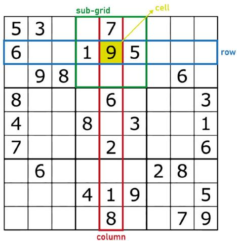

heatmap

| | 5 | 3 | 
|---|---|---| 
| 6 | 9 | 8 | 
| 8 | 6 | 6 | 
| 4 | 8 | 3 | 
| 7 | 2 | 6 | 
| 6 | 2 | 8 | 
| 4 | 1 | 9 | 
| 8 | 7 | 9 | 
column

(a)

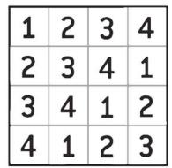

text_image

1 2 3 4
2 3 4 1
3 4 1 2
4 1 2 3

(b)

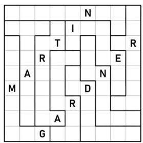

text_image

N
I
R
T
A
M
G
D
N
E
R
A

(c)

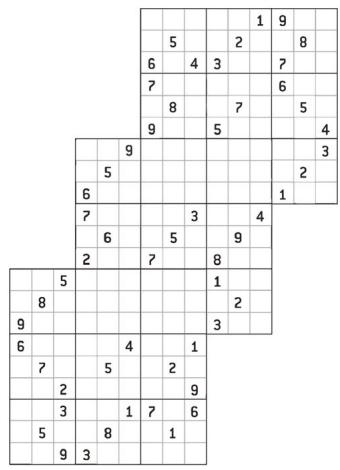

text_image

Cropped Sudoku puzzle grid with pre-filled numbers and some empty cells, likely for logic or pattern testing.

(d)   
Fig. 1 a 9  9 Sudoku grid with initial pre-defined cells specifying a cell with yellow color, a column with red color borders, a row with blue color borders and a sub-grid with green color borders. Various   
other alternative logic puzzles include b Latin square, c Du-Sum-Oh, and d Overlapping puzzle boards

#### 3 Computational models

#### 3.1 Cellular Automata

Due to its grid structure, Sudoku lends itself well to modeling using Cellular Automata (CA). CA combine computational capabilities along with mathematical and physical principles in order to study complex systems that can be modeled as grids of evolving cells with local interactions (Neumann 1966). Each cell has a state that is updated in discrete time-steps based on a set of rules, namely the transition function. This function specifies how the state of each cell evolves over time, taking into account the states of its neighboring cells (Chopard and Droz 1998). While its simplest form is a one-dimensional lattice of cells with binary states, the concept of CA can also be extended to two or more dimensions, where cells may exhibit more than two potential states.

A prominent characteristic of CA models is their capacity to exhibit emergent behavior, which means that complex patterns and behaviors can arise from the interactions between the cells even if the individual rules that govern their behavior are quite simple. At the same time, the inherent parallel computing architecture of CA processing, makes CA a flexible and powerful computational tool suitable for modeling and simulating large and complex systems (Wolfram 2018), allowing researchers to gain insights into the behavior of these systems that might not be possible with other modeling approaches and methods.

#### 3.2 Learning Automata

At the same time, Sudoku requires mechanisms that can be adapted to each grid and be able to learn from its evolution. Learning Automata (LA) theory is a branch of computer science and artificial intelligence that utilizes adaptive cells that can learn and improve their behavior over time (Jiang et al. 2016). LA are, actually, stochastic computational models designed to learn the optimal action in a dynamic environment through trial and error. Over time, the LA cells learn the optimal actions to take in each state, taking advantage of a reward and penalty system.

In LA, each cell interacts with its neighborhood and receives feedback in the form of rewards or penalties based on its actions. The cell uses this feedback to adjust its probabilities of taking different actions, with the goal of maximizing the long-term reward. One of the advantages of LA models is their ability to learn and adapt to changes in the environment (Narendra and Thathachar 1974). This makes them suitable for use in dynamic systems where the optimal behavior may change over time.

In detail, all actions from a set of L available actions \(T = \{ T _ { 1 } , T _ { 2 } , . . . , T _ { L } \}\) can be equally selected by the LA in the initial step. Afterwards, the LA selects its action based on its probability; therefore, there is an action probability vector \(P = \{ p _ { 1 } , p _ { 2 } , . . . , p _ { L } \}\) that characterizes the LA (Fig. 2a). During its time evolution, the \(\mathrm { L A }\) receives feedback from its environment through a reinforcement signal that is able to update the action probabilities. As a result, the LA penalizes the undesired actions by decreasing their probabilities and favors the desired ones by increasing them. In order for the LA to learn how to choose the optimal action depending on the application, this process should be repeated for a pre-defined number of timesteps (Narendra and Thathachar 1974).

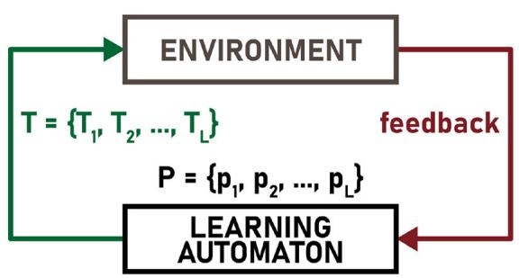

flowchart

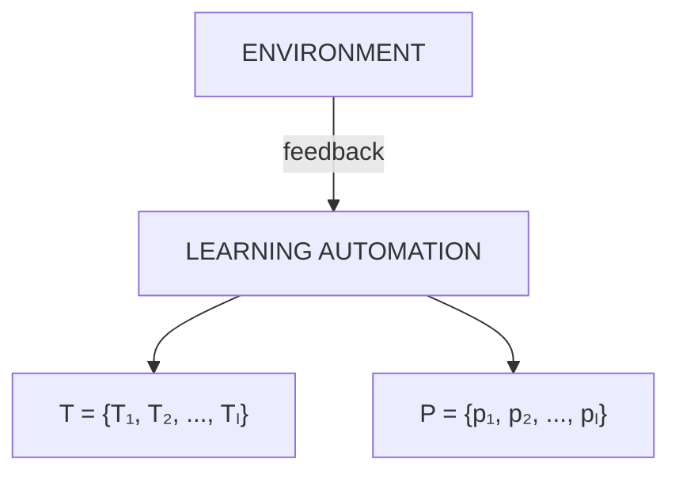
```mermaid
graph TD
    A["ENVIRONMENT"] -->|feedback| B["LEARNING AUTOMATION"]
    B --> C["T = {T₁, T₂, ..., Tₗ}"]
    B --> D["P = {p₁, p₂, ..., pₗ}"]
```

(a)

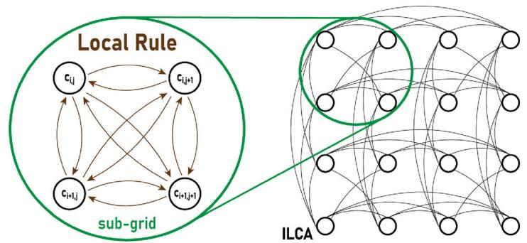

flowchart

```mermaid
graph TD
    subgraph_Local_Rule["Local Rule"]
        c_ij --> c_{i,j+1}
        c_{i,j+1} --> c_{i+1,j+1}
        c_{i+1,j} --> c_{i+1,j}
    end
    subgraph_Sub_Grid["Sub-Grid"]
        c_ij --> c_{i,j+1}
        c_{i,j+1} --> c_{i+1,j+1}
        c_{i+1,j} --> c_{i+1,j}
    end
    subgraph_ILCA_ILCA["ILCA"]
        ILCA --> c_ij
        ILCA --> c_{i,j+1}
        ILCA --> c_{i+1,j+1}
        ILCA --> c_{i+1,j-1}
    end
    style Local_Rule fill:#f9f,stroke:#333
    style Sub_Grid fill:#ccf,stroke:#333
    style ILCA_ILCA fill:#cfc,stroke:#333
```

(b)   
Fig. 2 a Learning Automaton structure. b 4  4 ILCA structure

#### 3.3 The concept of Irregular Learning Cellular Automata

Combining Cellular and Learning Automata can introduce the hybrid concept of Learning Cellular Automata (LCA), which is able to simulate the learning behavior in traditional CA. It consists of a grid of cells, where each cell has a state and an action probability vector. When a cell performs an action, it receives a reward or penalty depending on the outcome of the action. The learning process in LCA is distributed, meaning that each cell learns independently of its neighbors, which enables the system to adapt to changes in the environment promptly and efficiently. Consequently, LCA emerges as an ideal candidate for the resolution of complex logic puzzles, i.e. the Sudoku puzzles.

In contrast to traditional LCA, which features cells arranged in a regular grid, Irregular LCA (ILCA) models employ cells that are arbitrarily placed and connected, resulting in a more flexible and complex structure, making it suitable for solving Sudoku puzzles based on their rules. The connections between the cells can be defined in various ways, such as using a graph structure or using distancebased connections. One of the main advantages of ILCA models is their capacity to model more realistic and complex systems that cannot be adequately represented using regular grids.

In detail, considering an ILCA formed by N cells, each cell \(C _ { i }\) contains a LA whose action set \(T _ { i }\) is finite (for \(i = 1 , 2 , . . . , N )\) . Initially, every cell’s state is specified through the action probability vector of the LA, which governs its behavior over time. At every following iteration \(k ,\) each cell \(C _ { i }\) selects its state \(c _ { i }\) from the available action set \(T _ { i }\) . Based on the selected state \(c _ { i } ,\) a reinforcement signal computed using the ILCA’s rule is applied to the LA. This signal either rewards or penalizes the chosen action, and serves as the basis to update the action probability vector for the next time-step of the ILCA’s evolution in time. This iterative process continues for a sufficient number of timesteps, until the system achieves the desired behavior. Figure 2b presents an example of \({ \textrm { a 4 } } \times 4 ~ \mathrm { I L C A }\) grid with its irregular connections among its cells to be highlighted.

In general, various complex problems have been addressed using CA and its variations of LCA and ILCA. These problems include the bin-packing and the maximumcut ones (Mozafari et al. 2015), the shortest path (Tsompanas et al. 2018; Dourvas et al. 2019), the graph coloring (Torkestani and Meybodi 2011), the edge detection (Karamani et al. 2021), as well as the collision avoidance (Ioannidis et al. 2008; Mitsopoulou et al. 2019). These examples prove that they can provide viable and scalable solutions to computationally-heavy problems, such as the complex logic puzzles, combining their adaptivity with their inherit parallelism.

Algorithm 1 Pseudo code of the proposed ILCA Sudoku resolution algorithm   
1: FinalizedCells \(\Leftarrow 0\) 2:
3: for each cell \(C_{i,j}\) do
4:    if \(d_{i,j} == \| N_{i,j}\|\) then
5: \(P_{i,j}^{t+1}(c_{i,j}^t) = P_{i,j}^t(c_{i,j}^t) \cdot r(d_{i,j})\) 6:    FinalizedCells + +
7:    else
8:    if \(d_{i,j} > max[d_{k,l},\) for each \(C_{k,l} \in N_{i,j}\) where \(c_{k,l} = c_{i,j}\) then
9: \(P_{i,j}^{t+1}(c_{i,j}^t) = P_{i,j}^t(c_{i,j}^t) \cdot r(d_{i,j})\) 10:    else
11: \(P_{i,j}^{t+1}(c_{i,j}^t) = P_{i,j}^t(c_{i,j}^t) \cdot p(d_{i,j})\) 12:    end if
13:    end if
14: end for
15:
16: if FinalizedCells < TotalCells then
17:    goto line 1
18: end if

<table><tr><td>5</td><td>3</td><td>0</td><td>0</td><td>7</td><td>0</td><td>0</td><td>0</td><td>0</td></tr><tr><td>6</td><td>0</td><td>0</td><td>1</td><td>9</td><td>5</td><td>0</td><td>0</td><td>0</td></tr><tr><td>0</td><td>9</td><td>8</td><td>0</td><td>0</td><td>0</td><td>0</td><td>6</td><td>0</td></tr><tr><td>8</td><td>0</td><td>0</td><td>0</td><td>6</td><td>0</td><td>0</td><td>0</td><td>3</td></tr><tr><td>4</td><td>0</td><td>0</td><td>8</td><td>0</td><td>3</td><td>0</td><td>0</td><td>1</td></tr><tr><td>7</td><td>0</td><td>0</td><td>0</td><td>2</td><td>0</td><td>0</td><td>0</td><td>6</td></tr><tr><td>0</td><td>6</td><td>0</td><td>0</td><td>0</td><td>0</td><td>2</td><td>8</td><td>0</td></tr><tr><td>0</td><td>0</td><td>0</td><td>4</td><td>1</td><td>9</td><td>0</td><td>0</td><td>5</td></tr><tr><td>0</td><td>0</td><td>0</td><td>0</td><td>8</td><td>0</td><td>0</td><td>7</td><td>9</td></tr></table>

(a) Initial configuration

<table><tr><td>5</td><td>3</td><td>4</td><td>6</td><td>7</td><td>8</td><td>9</td><td>1</td><td>2</td></tr><tr><td>6</td><td>4</td><td>7</td><td>1</td><td>9</td><td>5</td><td>7</td><td>4</td><td>8</td></tr><tr><td>1</td><td>9</td><td>8</td><td>2</td><td>3</td><td>4</td><td>7</td><td>6</td><td>2</td></tr><tr><td>8</td><td>2</td><td>1</td><td>7</td><td>6</td><td>4</td><td>5</td><td>9</td><td>3</td></tr><tr><td>4</td><td>2</td><td>9</td><td>8</td><td>5</td><td>3</td><td>7</td><td>2</td><td>1</td></tr><tr><td>7</td><td>5</td><td>5</td><td>9</td><td>2</td><td>4</td><td>9</td><td>9</td><td>6</td></tr><tr><td>3</td><td>6</td><td>1</td><td>5</td><td>5</td><td>7</td><td>2</td><td>8</td><td>4</td></tr><tr><td>3</td><td>2</td><td>3</td><td>4</td><td>1</td><td>9</td><td>6</td><td>3</td><td>5</td></tr><tr><td>2</td><td>5</td><td>3</td><td>2</td><td>8</td><td>2</td><td>1</td><td>7</td><td>9</td></tr></table>

(b) Time-step 1

<table><tr><td>5</td><td>3</td><td>1</td><td>6</td><td>7</td><td>8</td><td>4</td><td>1</td><td>4</td></tr><tr><td>6</td><td>2</td><td>4</td><td>1</td><td>9</td><td>5</td><td>3</td><td>3</td><td>8</td></tr><tr><td>1</td><td>9</td><td>8</td><td>3</td><td>3</td><td>2</td><td>5</td><td>6</td><td>4</td></tr><tr><td>8</td><td>1</td><td>5</td><td>7</td><td>6</td><td>7</td><td>5</td><td>5</td><td>3</td></tr><tr><td>4</td><td>5</td><td>9</td><td>8</td><td>5</td><td>3</td><td>9</td><td>5</td><td>1</td></tr><tr><td>7</td><td>1</td><td>1</td><td>5</td><td>2</td><td>1</td><td>5</td><td>4</td><td>6</td></tr><tr><td>1</td><td>6</td><td>5</td><td>7</td><td>3</td><td>7</td><td>2</td><td>8</td><td>4</td></tr><tr><td>2</td><td>7</td><td>2</td><td>4</td><td>1</td><td>9</td><td>6</td><td>3</td><td>5</td></tr><tr><td>3</td><td>1</td><td>1</td><td>5</td><td>8</td><td>6</td><td>1</td><td>7</td><td>9</td></tr></table>

(c) Time-step 2

<table><tr><td>5</td><td>3</td><td>2</td><td>6</td><td>7</td><td>8</td><td>8</td><td>1</td><td>8</td></tr><tr><td>6</td><td>2</td><td>4</td><td>1</td><td>9</td><td>5</td><td>4</td><td>2</td><td>8</td></tr><tr><td>2</td><td>9</td><td>8</td><td>3</td><td>4</td><td>2</td><td>4</td><td>6</td><td>7</td></tr><tr><td>8</td><td>5</td><td>2</td><td>9</td><td>6</td><td>1</td><td>7</td><td>4</td><td>3</td></tr><tr><td>4</td><td>2</td><td>9</td><td>8</td><td>5</td><td>3</td><td>5</td><td>9</td><td>1</td></tr><tr><td>7</td><td>5</td><td>3</td><td>9</td><td>2</td><td>1</td><td>4</td><td>4</td><td>6</td></tr><tr><td>9</td><td>6</td><td>3</td><td>3</td><td>3</td><td>7</td><td>2</td><td>8</td><td>4</td></tr><tr><td>2</td><td>7</td><td>7</td><td>4</td><td>1</td><td>9</td><td>6</td><td>3</td><td>5</td></tr><tr><td>3</td><td>2</td><td>2</td><td>3</td><td>8</td><td>6</td><td>6</td><td>7</td><td>9</td></tr></table>

(d) Time-step 3

<table><tr><td>5</td><td>3</td><td>4</td><td>6</td><td>7</td><td>8</td><td>1</td><td>1</td><td>2</td></tr><tr><td>6</td><td>7</td><td>4</td><td>1</td><td>9</td><td>5</td><td>8</td><td>4</td><td>8</td></tr><tr><td>1</td><td>9</td><td>8</td><td>2</td><td>3</td><td>2</td><td>1</td><td>6</td><td>7</td></tr><tr><td>8</td><td>5</td><td>9</td><td>5</td><td>6</td><td>1</td><td>7</td><td>2</td><td>3</td></tr><tr><td>4</td><td>5</td><td>5</td><td>8</td><td>5</td><td>3</td><td>9</td><td>9</td><td>1</td></tr><tr><td>7</td><td>5</td><td>9</td><td>9</td><td>2</td><td>4</td><td>8</td><td>5</td><td>6</td></tr><tr><td>9</td><td>6</td><td>7</td><td>5</td><td>5</td><td>7</td><td>2</td><td>8</td><td>4</td></tr><tr><td>2</td><td>7</td><td>2</td><td>4</td><td>1</td><td>9</td><td>6</td><td>3</td><td>5</td></tr><tr><td>1</td><td>4</td><td>4</td><td>6</td><td>8</td><td>6</td><td>3</td><td>7</td><td>9</td></tr></table>

(e) Time-step 4

<table><tr><td>5</td><td>3</td><td>4</td><td>6</td><td>7</td><td>8</td><td>9</td><td>1</td><td>2</td></tr><tr><td>6</td><td>7</td><td>2</td><td>1</td><td>9</td><td>5</td><td>3</td><td>2</td><td>8</td></tr><tr><td>1</td><td>9</td><td>8</td><td>2</td><td>3</td><td>2</td><td>3</td><td>6</td><td>7</td></tr><tr><td>8</td><td>2</td><td>1</td><td>7</td><td>6</td><td>1</td><td>7</td><td>2</td><td>3</td></tr><tr><td>4</td><td>2</td><td>6</td><td>8</td><td>5</td><td>3</td><td>5</td><td>2</td><td>1</td></tr><tr><td>7</td><td>1</td><td>5</td><td>5</td><td>2</td><td>4</td><td>8</td><td>4</td><td>6</td></tr><tr><td>9</td><td>6</td><td>4</td><td>7</td><td>5</td><td>7</td><td>2</td><td>8</td><td>4</td></tr><tr><td>3</td><td>8</td><td>7</td><td>4</td><td>1</td><td>9</td><td>6</td><td>3</td><td>5</td></tr><tr><td>3</td><td>4</td><td>5</td><td>5</td><td>8</td><td>6</td><td>4</td><td>7</td><td>9</td></tr></table>

(f) Time-step 5

<table><tr><td>5</td><td>3</td><td>4</td><td>6</td><td>7</td><td>8</td><td>9</td><td>1</td><td>2</td></tr><tr><td>6</td><td>7</td><td>2</td><td>1</td><td>9</td><td>5</td><td>3</td><td>4</td><td>8</td></tr><tr><td>1</td><td>9</td><td>8</td><td>3</td><td>3</td><td>2</td><td>3</td><td>6</td><td>7</td></tr><tr><td>8</td><td>1</td><td>9</td><td>9</td><td>6</td><td>1</td><td>7</td><td>2</td><td>3</td></tr><tr><td>4</td><td>5</td><td>6</td><td>8</td><td>5</td><td>3</td><td>5</td><td>9</td><td>1</td></tr><tr><td>7</td><td>1</td><td>3</td><td>9</td><td>2</td><td>4</td><td>8</td><td>5</td><td>6</td></tr><tr><td>9</td><td>6</td><td>9</td><td>5</td><td>3</td><td>7</td><td>2</td><td>8</td><td>4</td></tr><tr><td>2</td><td>8</td><td>7</td><td>4</td><td>1</td><td>9</td><td>6</td><td>3</td><td>5</td></tr><tr><td>1</td><td>5</td><td>5</td><td>6</td><td>8</td><td>6</td><td>1</td><td>7</td><td>9</td></tr></table>

(g) Time-step 6

<table><tr><td>5</td><td>3</td><td>4</td><td>6</td><td>7</td><td>8</td><td>9</td><td>1</td><td>2</td></tr><tr><td>6</td><td>7</td><td>2</td><td>1</td><td>9</td><td>5</td><td>8</td><td>4</td><td>8</td></tr><tr><td>1</td><td>9</td><td>8</td><td>2</td><td>4</td><td>2</td><td>7</td><td>6</td><td>7</td></tr><tr><td>8</td><td>2</td><td>1</td><td>7</td><td>6</td><td>1</td><td>7</td><td>2</td><td>3</td></tr><tr><td>4</td><td>2</td><td>6</td><td>8</td><td>5</td><td>3</td><td>9</td><td>9</td><td>1</td></tr><tr><td>7</td><td>1</td><td>3</td><td>9</td><td>2</td><td>4</td><td>8</td><td>4</td><td>6</td></tr><tr><td>9</td><td>6</td><td>5</td><td>5</td><td>3</td><td>7</td><td>2</td><td>8</td><td>4</td></tr><tr><td>2</td><td>8</td><td>7</td><td>4</td><td>1</td><td>9</td><td>6</td><td>3</td><td>5</td></tr><tr><td>3</td><td>4</td><td>5</td><td>2</td><td>8</td><td>6</td><td>3</td><td>7</td><td>9</td></tr></table>

(h) Time-step 7

<table><tr><td>5</td><td>3</td><td>4</td><td>6</td><td>7</td><td>8</td><td>9</td><td>1</td><td>2</td></tr><tr><td>6</td><td>7</td><td>2</td><td>1</td><td>9</td><td>5</td><td>3</td><td>4</td><td>8</td></tr><tr><td>1</td><td>9</td><td>8</td><td>3</td><td>4</td><td>2</td><td>5</td><td>6</td><td>7</td></tr><tr><td>8</td><td>1</td><td>9</td><td>9</td><td>6</td><td>4</td><td>7</td><td>2</td><td>3</td></tr><tr><td>4</td><td>2</td><td>6</td><td>8</td><td>5</td><td>3</td><td>7</td><td>9</td><td>1</td></tr><tr><td>7</td><td>1</td><td>3</td><td>9</td><td>2</td><td>4</td><td>8</td><td>5</td><td>6</td></tr><tr><td>9</td><td>6</td><td>1</td><td>5</td><td>3</td><td>7</td><td>2</td><td>8</td><td>4</td></tr><tr><td>2</td><td>8</td><td>7</td><td>4</td><td>1</td><td>9</td><td>6</td><td>3</td><td>5</td></tr><tr><td>3</td><td>4</td><td>3</td><td>6</td><td>8</td><td>6</td><td>1</td><td>7</td><td>9</td></tr></table>

(i) Time-step 8

<table><tr><td>5</td><td>3</td><td>4</td><td>6</td><td>7</td><td>8</td><td>9</td><td>1</td><td>2</td></tr><tr><td>6</td><td>7</td><td>2</td><td>1</td><td>9</td><td>5</td><td>3</td><td>4</td><td>8</td></tr><tr><td>1</td><td>9</td><td>8</td><td>3</td><td>4</td><td>2</td><td>5</td><td>6</td><td>7</td></tr><tr><td>8</td><td>5</td><td>2</td><td>5</td><td>6</td><td>7</td><td>7</td><td>2</td><td>3</td></tr><tr><td>4</td><td>2</td><td>6</td><td>8</td><td>5</td><td>3</td><td>7</td><td>9</td><td>1</td></tr><tr><td>7</td><td>5</td><td>3</td><td>9</td><td>2</td><td>4</td><td>8</td><td>5</td><td>6</td></tr><tr><td>9</td><td>6</td><td>1</td><td>5</td><td>3</td><td>7</td><td>2</td><td>8</td><td>4</td></tr><tr><td>2</td><td>8</td><td>7</td><td>4</td><td>1</td><td>9</td><td>6</td><td>3</td><td>5</td></tr><tr><td>1</td><td>4</td><td>4</td><td>2</td><td>8</td><td>6</td><td>1</td><td>7</td><td>9</td></tr></table>

(j) Time-step 9

<table><tr><td>5</td><td>3</td><td>4</td><td>6</td><td>7</td><td>8</td><td>9</td><td>1</td><td>2</td></tr><tr><td>6</td><td>7</td><td>2</td><td>1</td><td>9</td><td>5</td><td>3</td><td>4</td><td>8</td></tr><tr><td>1</td><td>9</td><td>8</td><td>3</td><td>4</td><td>2</td><td>5</td><td>6</td><td>7</td></tr><tr><td>8</td><td>2</td><td>9</td><td>7</td><td>6</td><td>1</td><td>9</td><td>2</td><td>3</td></tr><tr><td>4</td><td>2</td><td>6</td><td>8</td><td>5</td><td>3</td><td>7</td><td>9</td><td>1</td></tr><tr><td>7</td><td>1</td><td>3</td><td>9</td><td>2</td><td>4</td><td>8</td><td>5</td><td>6</td></tr><tr><td>9</td><td>6</td><td>1</td><td>5</td><td>3</td><td>7</td><td>2</td><td>8</td><td>4</td></tr><tr><td>2</td><td>8</td><td>7</td><td>4</td><td>1</td><td>9</td><td>6</td><td>3</td><td>5</td></tr><tr><td>2</td><td>4</td><td>5</td><td>2</td><td>8</td><td>6</td><td>1</td><td>7</td><td>9</td></tr></table>

(k) Time-step 10

<table><tr><td>5</td><td>3</td><td>4</td><td>6</td><td>7</td><td>8</td><td>9</td><td>1</td><td>2</td></tr><tr><td>6</td><td>7</td><td>2</td><td>1</td><td>9</td><td>5</td><td>3</td><td>4</td><td>8</td></tr><tr><td>1</td><td>9</td><td>8</td><td>3</td><td>4</td><td>2</td><td>5</td><td>6</td><td>7</td></tr><tr><td>8</td><td>1</td><td>5</td><td>7</td><td>6</td><td>1</td><td>4</td><td>2</td><td>3</td></tr><tr><td>4</td><td>2</td><td>6</td><td>8</td><td>5</td><td>3</td><td>7</td><td>9</td><td>1</td></tr><tr><td>7</td><td>1</td><td>3</td><td>9</td><td>2</td><td>4</td><td>8</td><td>5</td><td>6</td></tr><tr><td>9</td><td>6</td><td>1</td><td>5</td><td>3</td><td>7</td><td>2</td><td>8</td><td>4</td></tr><tr><td>2</td><td>8</td><td>7</td><td>4</td><td>1</td><td>9</td><td>6</td><td>3</td><td>5</td></tr><tr><td>3</td><td>4</td><td>5</td><td>2</td><td>8</td><td>6</td><td>1</td><td>7</td><td>9</td></tr></table>

(1) Time-step 11

<table><tr><td>5</td><td>3</td><td>4</td><td>6</td><td>7</td><td>8</td><td>9</td><td>1</td><td>2</td></tr><tr><td>6</td><td>7</td><td>2</td><td>1</td><td>9</td><td>5</td><td>3</td><td>4</td><td>8</td></tr><tr><td>1</td><td>9</td><td>8</td><td>3</td><td>4</td><td>2</td><td>5</td><td>6</td><td>7</td></tr><tr><td>8</td><td>5</td><td>9</td><td>7</td><td>6</td><td>1</td><td>4</td><td>2</td><td>3</td></tr><tr><td>4</td><td>2</td><td>6</td><td>8</td><td>5</td><td>3</td><td>7</td><td>9</td><td>1</td></tr><tr><td>7</td><td>1</td><td>3</td><td>9</td><td>2</td><td>4</td><td>8</td><td>5</td><td>6</td></tr><tr><td>9</td><td>6</td><td>1</td><td>5</td><td>3</td><td>7</td><td>2</td><td>8</td><td>4</td></tr><tr><td>2</td><td>8</td><td>7</td><td>4</td><td>1</td><td>9</td><td>6</td><td>3</td><td>5</td></tr><tr><td>3</td><td>4</td><td>5</td><td>2</td><td>8</td><td>6</td><td>1</td><td>7</td><td>9</td></tr></table>

(m) Time-step 12

<table><tr><td>5</td><td>3</td><td>4</td><td>6</td><td>7</td><td>8</td><td>9</td><td>1</td><td>2</td></tr><tr><td>6</td><td>7</td><td>2</td><td>1</td><td>9</td><td>5</td><td>3</td><td>4</td><td>8</td></tr><tr><td>1</td><td>9</td><td>8</td><td>3</td><td>4</td><td>2</td><td>5</td><td>6</td><td>7</td></tr><tr><td>8</td><td>5</td><td>9</td><td>7</td><td>6</td><td>1</td><td>4</td><td>2</td><td>3</td></tr><tr><td>4</td><td>2</td><td>6</td><td>8</td><td>5</td><td>3</td><td>7</td><td>9</td><td>1</td></tr><tr><td>7</td><td>1</td><td>3</td><td>9</td><td>2</td><td>4</td><td>8</td><td>5</td><td>6</td></tr><tr><td>9</td><td>6</td><td>1</td><td>5</td><td>3</td><td>7</td><td>2</td><td>8</td><td>4</td></tr><tr><td>2</td><td>8</td><td>7</td><td>4</td><td>1</td><td>9</td><td>6</td><td>3</td><td>5</td></tr><tr><td>3</td><td>4</td><td>5</td><td>2</td><td>8</td><td>6</td><td>1</td><td>7</td><td>9</td></tr></table>

(n) Time-step 13   
Fig. 3 Step-by-step resolution of a \(9 \times 9\) Sudoku using the proposed algorithm. Updated cell states \(( c _ { i , j } ^ { t } )\) in each evolution time-step is presented in blue with yellow background. The final solved puzzle are presented on (n) Time-step 13

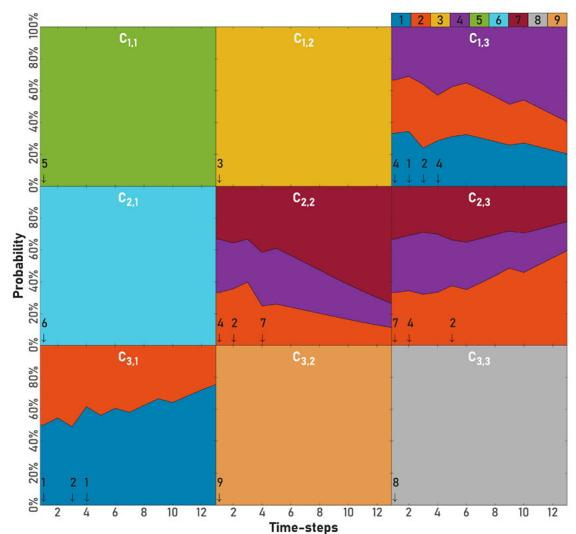  
(a) Upper-left sub-grid

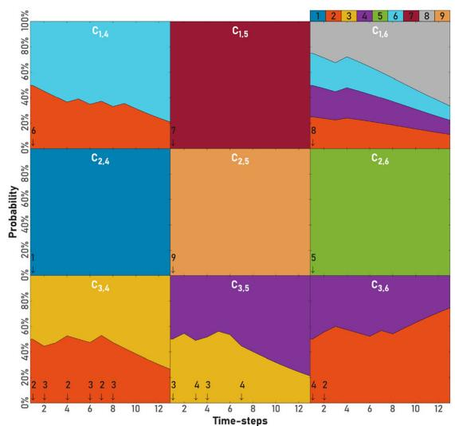

heatmap

| Time-steps | C1,4 (%) | C1,5 (%) | C1,6 (%) | C2,4 (%) | C2,5 (%) | C2,6 (%) | C3,4 (%) | C3,5 (%) | C3,6 (%) |
|---|---|---|---|---|---|---|---|---|---|
| 2 | 60 | 70 | 8 | 80 | 90 | 9 | 60 | 60 | 60 |
| 4 | 50 | 80 | 7 | 70 | 80 | 90 | 50 | 50 | 50 |
| 6 | 40 | 85 | 6 | 60 | 75 | 85 | 40 | 45 | 45 |
| 8 | 35 | 90 | 5 | 50 | 70 | 80 | 35 | 40 | 40 |
| 10 | 30 | 95 | 4 | 40 | 65 | 75 | 30 | 35 | 35 |
| 12 | 25 | 98 | 3 | 30 | 60 | 78 | 25 | 30 | 30 |
The chart displays a stacked area chart with color-coded categories (1-9) representing different categories at each time step. The x-axis is labeled 'Time-steps' and the y-axis is labeled 'Probability'. The legend indicates the category labels are numbered from 1 to 9 in the top row.

(b) Upper-center sub-grid

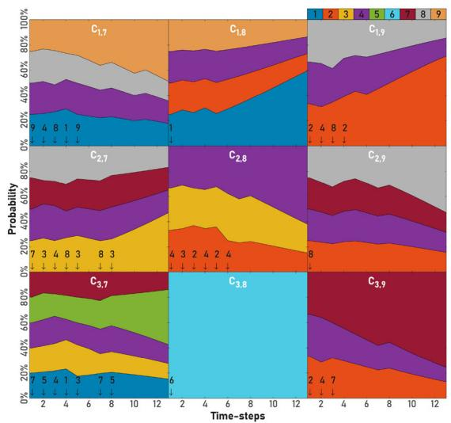

area_stacked

| Time-step | C1.7 | C1.8 | C1.9 | C2.7 | C2.8 | C2.9 | C3.7 | C3.8 | C3.9 |
|---|---|---|---|---|---|---|---|---|---|
| 2 | 9 | 4 | 8 | 2 | 2 | 4 | 7 | 6 | 2 |
| 4 | 9 | 4 | 8 | 2 | 2 | 4 | 7 | 6 | 2 |
| 6 | 9 | 4 | 8 | 2 | 2 | 4 | 7 | 6 | 2 |
| 8 | 9 | 4 | 8 | 2 | 2 | 4 | 7 | 6 | 2 |
| 10 | 9 | 4 | 8 | 2 | 2 | 4 | 7 | 6 | 2 |
| 12 | 9 | 4 | 8 | 2 | 2 | 4 | 7 | 6 | 2 |
The chart displays the probability distribution of C1.7 through C3.9 over time steps from 2 to 12. Each colored layer represents a distinct category, with numerical labels indicating specific probability values at each time step. The legend uses a color scale from blue (lower) to red (higher) to distinguish categories.

(c) Upper-right sub-grid

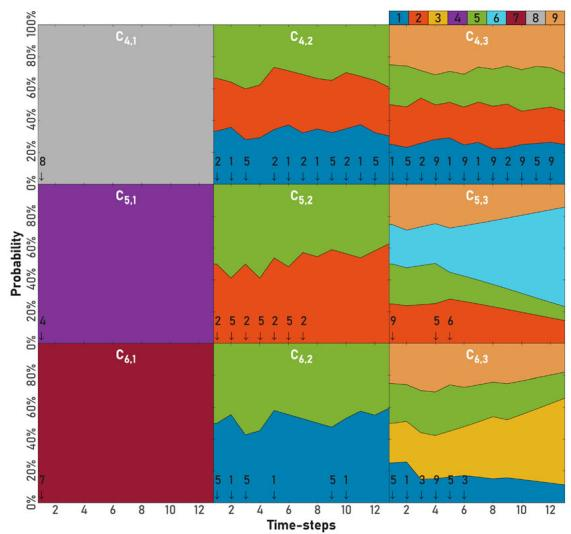

bar_stacked

| Time-step | C4,1 (%) | C4,2 (%) | C4,3 (%) | C5,1 (%) | C5,2 (%) | C5,3 (%) | C6,1 (%) | C6,2 (%) | C6,3 (%) |
|---|---|---|---|---|---|---|---|---|---|
| 2 | 80 | 20 | 10 | 80 | 20 | 10 | 5 | 20 | 10 |
| 4 | 80 | 20 | 10 | 80 | 20 | 10 | 5 | 20 | 10 |
| 6 | 80 | 20 | 10 | 80 | 20 | 10 | 5 | 20 | 10 |
| 8 | 80 | 20 | 10 | 80 | 20 | 10 | 5 | 20 | 10 |
| 10 | 80 | 20 | 10 | 80 | 20 | 10 | 5 | 20 | 10 |
| 12 | 80 | 20 | 10 | 80 | 20 | 10 | 5 | 20 | 10 |
The chart displays a stacked area chart with color-coded categories labeled 1 through 9. The x-axis represents Time-steps from 2 to 12, and the y-axis represents Probability ranging from -20% to +20%. The legend is implicit in the color coding for each category. No explicit numerical values are provided; the chart type is a single-series visualization.

(d) Middle-left sub-grid

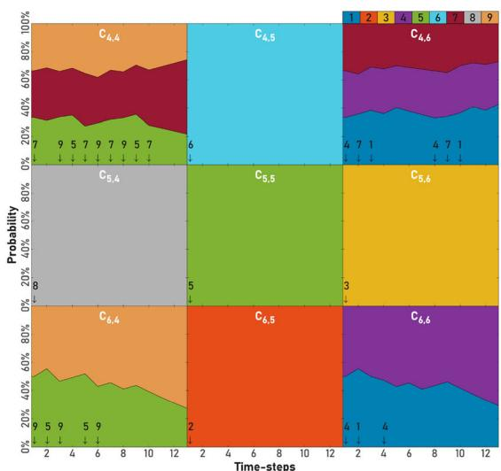

heatmap

| Time-steps | C4,4 (%) | C4,5 (%) | C4,6 (%) | C5,4 (%) | C5,5 (%) | C5,6 (%) | C6,4 (%) | C6,5 (%) | C6,6 (%) |
|---|---|---|---|---|---|---|---|---|---|
| 2 | 7 | 9 | 4 | 8 | 5 | 3 | 9 | 2 | 4 |
| 4 | 9 | 5 | 7 | 0 | 0 | 0 | 5 | 9 | 4 |
| 6 | 7 | 7 | 9 | 0 | 0 | 0 | 5 | 9 | 4 |
| 8 | 7 | 9 | 7 | 0 | 0 | 0 | 5 | 9 | 4 |
| 10 | 7 | 5 | 7 | 0 | 0 | 0 | 5 | 9 | 4 |
| 12 | 6 | 8 | 6 | 0 | 0 | 0 | 3 | 2 | 4 |
Time-step: C4,4, C4,5, C4,6, C5,4, C5,5, C5,6, C6,6.

(e) Middle-center sub-grid

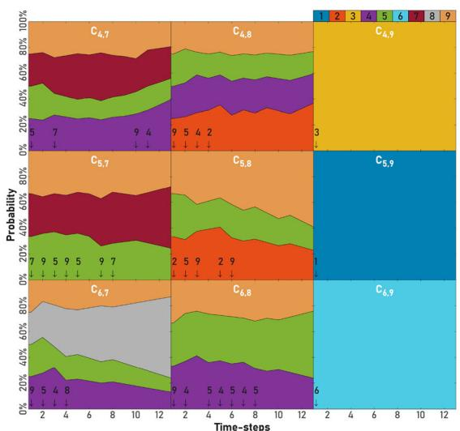

area_stacked

| Time-step | C4.7 | C4.8 | C4.9 | C5.7 | C5.8 | C5.9 | C6.7 | C6.8 | C6.9 |
|---|---|---|---|---|---|---|---|---|---|
| 2 | 5 | 7 | 9 | 7 | 2 | 5 | 9 | 4 | 6 |
| 4 | 7 | 4 | 5 | 9 | 2 | 5 | 9 | 4 | 6 |
| 6 | 9 | 4 | 6 | 9 | 2 | 5 | 9 | 4 | 6 |
| 8 | 9 | 4 | 6 | 9 | 2 | 5 | 9 | 4 | 6 |
| 10 | 9 | 4 | 6 | 9 | 2 | 5 | 9 | 4 | 6 |
| 12 | 9 | 4 | 6 | 9 | 2 | 5 | 9 | 4 | 6 |
The chart displays the probability distribution of C4.7 through C6.9 over time steps from 2 to 12. Each colored layer corresponds to a specific category, with values labeled at the top of each layer. The vertical arrows indicate downward or upward trends in the probability range for each category at specific time steps. No explicit numerical values are provided for the data series.

(f) Middle-right sub-grid

b Fig. 4 Stacked plot of the action probability vector \(( P _ { i , j } ^ { t } )\) evolution in time-steps for each possible cell state \(( c \in \{ 1 , 2 , . . . , \overset { . } { 9 } \}\) presented in different colors) for every cell of the \(9 \times 9\) Sudoku. Updated cell states \(( c _ { i , j } ^ { t } )\) in each evolution time-step is presented in the lower part of each plot with an arrow (#)

#### 4 Proposed resolution algorithm

Since in Sudoku, the cells are not connected in a regular way, the grid of the puzzle can be modeled as a CA by mapping it into a graph (Chong Leung et al. 2014) with 81 nodes \(( 9 \times 9 ) ;\) each one representing a puzzle cell \(C _ { i , j }\) (for \(i = 1 , 2 , . . . , 9\) and \(j = 1 , 2 , . . . , 9 )\) . The nodes relate to undirected edges following the Sudoku puzzles rules and incorporate 9 different states each \(( c \in \{ 1 , 2 , . . . , 9 \} )\) . Each node has 20 neighbors \(( N _ { i , j } )\) without itself, while the \(\mathrm { I L C A ^ { \prime } s }\) evolution rule depends on the states of all the neighbors.

Definition 1 (Neighbors) In Sudoku, every cell \(C _ { i , j }\) in neighborhood \(N _ { i , j }\) , where \(1 \leq i \leq 9\) and \(1 \leq j \leq 9\) , is linked to all the cells in its column \(( N _ { i , j } ^ { c } )\) , row \(( N _ { i , j } ^ { r } )\) and \(3 \times 3\) subgrid \(( N _ { i , j } ^ { s g } )\) , where:

\[
N _ {i, j} ^ {c} = \{C _ {1, j}, C _ {2, j},..., C _ {9, j} \} \tag {1}
\]

\[
N _ {i, j} ^ {r} = \left\{C _ {i, 1}, C _ {i, 2}, \dots , C _ {i, 9} \right\} \tag {2}
\]

\[
N _ {i, j} ^ {s g} = \left\{C _ {i - 1, j - 1}, C _ {i - 1, j}, C _ {i - 1, j + 1}, \right. \tag {3}
\]

\[
\left. \left. C _ {i, j - 1}, C _ {i, j}, C _ {i, j + 1}, C _ {i + 1, j - 1}, C _ {i + 1, j}, C _ {i + 1, j + 1} \right\} \right.
\]

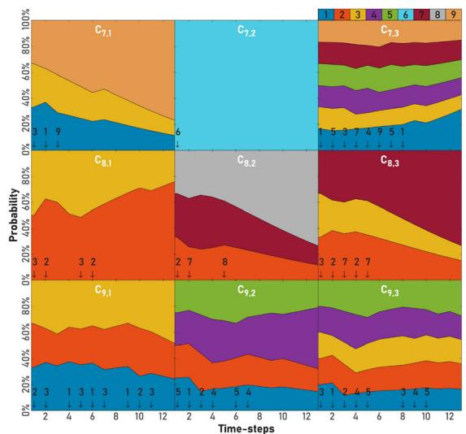  
(g) Lower-left sub-grid

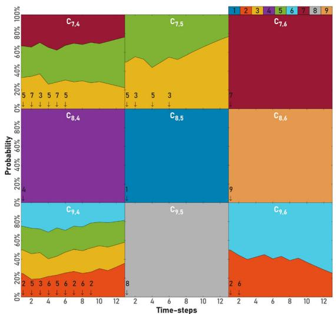

heatmap

| Time-steps | C7.4 | C7.5 | C7.6 | C8.4 | C8.5 | C8.6 | C9.4 | C9.5 | C9.6 | 1 | 2 | 3 | 4 | 5 | 6 | 7 | 8 | 9 |
|---|---|---|---|---|---|---|---|---|---|---|---|---|---|---|---|---|---|---|
| 2 | 0% | 0% | 0% | 0% | 0% | 0% | 0% | 0% | 0% | 0% | 0% | 0% | 0% | 0% | 0% | 0% | 0% | 0% |
| 4 | 0% | 0% | 0% | 0% | 0% | 0% | 0% | 0% | 0% | 0% | 0% | 0% | 0% | 0% | 0% | 0% | 0% | 0% |
| 6 | 0% | 0% | 0% | 0% | 0% | 0% | 0% | 0% | 0% | 0% | 0% | 0% | 0% | 0% | 0% | 0% | 0% | 0% |
| 8 | 0% | 0% | 0% | 0% | 0% | 0% | 0% | 0% | 0% | 0% | 0% | 0% | 0% | 0% | 0% | 0% | 0% | 0% |
| 10 | 0% | 0% | 0% | 0% | 0% | 0% | 0% | 0% | 0% | 0% | 0% | 0% | 0% | 0% | 0% | 0% | 0% | 0% |
| 12 | 0% | 0% | 0% | 0% | 0% | 0% | 0% | 0% | 0% | 0% | 0% | 0% | 0% | 0% | 0% | 0% | 0% | 0% |
Legend: Values represent probability for each category at specific time-step intervals. The chart displays a single color-coded legend (1-9) representing different categories or conditions. No trend or correlation is present — this is a static visual representation.

(h) Lower-center sub-grid

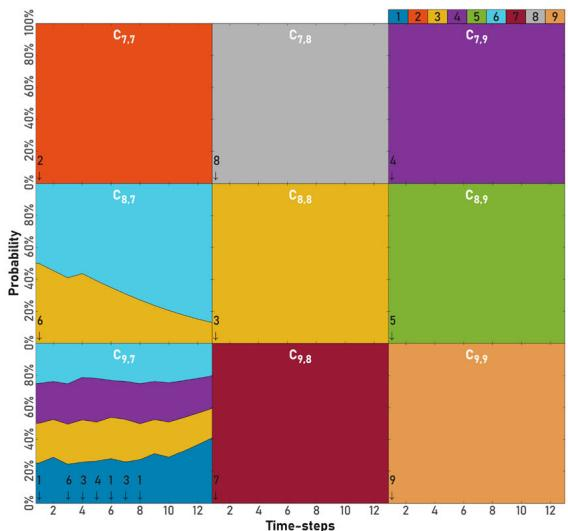

heatmap

| | 1 | 2 | 3 | 4 | 5 | 6 | 7 | 8 | 9 |
|---|---|---|---|---|---|---|---|---|---|
| C7.7 | 100% | 0% | 0% | 0% | 0% | 0% | 0% | 0% | 0% |
| C7.8 | 100% | 0% | 0% | 0% | 0% | 0% | 0% | 0% | 0% |
| C7.9 | 100% | 0% | 0% | 0% | 0% | 0% | 0% | 0% | 0% |
| C8.7 | 100% | 0% | 0% | 0% | 0% | 0% | 0% | 0% | 0% |
| C8.8 | 100% | 0% | 0% | 0% | 0% | 0% | 0% | 0% | 0% |
| C8.9 | 100% | 0% | 0% | 0% | 0% | 0% | 0% | 0% | 0% |
| C9.7 | 100% | 0% | 0% | 0% | 0% | 0% | 0% | 0% | 0% |
| C9.8 | 100% | 0% | 0% | 0% | 0% | 0% | 0% | 0% | 0% |
| C9.9 | 100% | 0% | 0% | 0% | 0% | 0% | 0% | 0% | 0% |
| C7.7 (Time-step) = Probability (top-left) [1,2] [3,4] [6,7] [9] [12] [2,3] [4,5] [6,7] [8,9] [12] [2,3] [4,5] [6,7] [8,9] [12] [2,3] [4,5] [6,7] [8,9] [12] [2,3] [4,5] [6,7] [8,9] [12] [2,3] [4,5] [6,7] [8,9] [8,9] [12] [2,3] [4,5] [6,7] [8,9] [12] [2,3] [4,5] [6,7] [8,9] [12] [2,3] [4,5] [6,7] [8,9] [12] [2,3] [4,5] [6,7] [8] [12] [2,3] [4,5] [6,7] [8,9] [12] [2,3] [4,5] [6,7] [8,9] [12] [2,3] [4,5] [6,7] [8,9] [12] [2,3] [4,5] [6,7] [8,9] [11]
[1,2,3,4,5,6,7,8,9] [12,3,4,5,6,7,8,9] [12,3,4,5,6,7,8,9] [12,3,4,5,6,7,8,9] [12,3,4,5,6,7,8,9] [12,3,4,5,6,7,8,9] [12,3,4,5,6]

(i) Lower-right sub-grid   
Fig. 4 continued

\[
N _ {i, j} = N _ {i, j} ^ {c} \cup N _ {i, j} ^ {r} \cup N _ {i, j} ^ {s g} \cap C _ {i, j} \tag {4}
\]

To solve a Sudoku puzzle, learning features can be utilized in order to get adjusted to each puzzle’s specific initial pre-filled cells assignment. This requests the addition of a LA to each cell of the CA, transforming it to a LCA and when combined with the irregularity of the graph, finally to an ILCA. Every cell’s LA has an action probability vector that changes every time-step based on a reward and penalty algorithm until the ILCA picks a valid solution. The ILCA chooses an action based on the cell’s degree \(( d _ { i , j } )\) . It is important to note that every Sudoku puzzle has only one solution based on the pre-filled cells.

Definition 2 (Cell Degree) Degree of a cell \(d _ { i , j }\) is defined as the number of neighboring cells that did not choose the same action (i.e. number of cells where the selected action is different):

\[
d _ {i, j} = \left\| C _ {k, l}, \text {   for   each   } C _ {k, l} \in N _ {i, j} \text {   where   } c _ {k, l} \neq c _ {i, j} \right\| \tag {5}
\]

Each cell of the ILCA has variables for its chosen action, which corresponds to the cell state \(( c _ { i , j } )\) and its action probability vector \(( P _ { i , j } ( n ) )\) . The ILCA receives the Sudoku graph with some numbers already filled as predefined input. At first, the given numbers are considered to have a 100% probability while their neighbors have a 0% probability. For the other cells and numbers, all states are equally likely to be chosen. The ILCA produces the solved puzzle as output.

Definition 3 (Chosen Action) The chosen action which depicts the cell’s state is considered as the number (n) with the highest probability.

\[
c _ {i, j} ^ {t} = n, \text {   where   } P _ {i, j} ^ {t} (n) = \max \left[ P _ {i, j} ^ {t} (k) \right], k \in [ 1, 9 ] \tag {6}
\]

Definition 4 (Reward and Penalty) In each step, the probability vector is rewarded or penalized by multiplying the respective probability of the number by a factor r (reward) or p (penalty):

\[
P _ {i, j} ^ {t + 1} (n) = P _ {i, j} ^ {t} (n) \cdot (r (\bullet) \mid p (\bullet)), \tag {7}
\]

\(\mathrm { w h e r e ~ } r ( \bullet ) > 1 \mathrm { ~ a n d ~ } p ( \bullet ) < 1\)

Algorithm 1 occurs after the ILCA has been successfully initialized in order to produce the output, where all cell states are checked to meet the requirements of a resolved puzzle. In particular, if the cell has a different state from all its neighbors, which means its degree matches the number of its neighbors, then it gets a reward, and its probability increases (lines 4-6). If the cell is in a state shared by those of its neighbors, then it only gets a reward if its degree is higher than all its neighbors’ degrees (lines 8-9). Otherwise, it gets penalized and its probability decreases (lines 10-11). Then, each cell will select its new state based on the action with the highest probability from its available action set. This process continues until all cells have different states from their neighbors, in specific, when FinalizedCells equals the total number of ILCA cells (TotalCells; lines 16-19).

#### 4.1 Resolution demonstration

The MATL \({ \bf A } { \bf B } ^ { \circledast }\) R2020a software was used for the simulation of the proposed algorithm utilizing \(9 \times 9\) Sudoku grids as a proof of concept. The initial values of the predefined cells are shown in Fig. 3a with the rest of the cells whose state is not pre-assigned and which are therefore assigned the state \(^ { 6 6 } 0 ^ { 6 6 }\) , while the evolution of the ILCA in each time-step, when there is a cell state update, is highlighted in blue with yellow background (Fig. 3b–m). More specifically, in the first time-step (Fig. 3b) the cells without pre-assigned state select their initial action. Following the Algorithm 1, these actions are rewarded or penalized resulting in changes in the action probability vector. This leads to Fig. 3c, where the cells select their new action and some of them update their state. This process continues until all cells are rewarded on the last time-step resulting in no further cell state changes (Fig. 3n). It is important to highlight that after only 8 time-steps, just a few cells remain to be changed, resulting in the solution of the \(9 \times 9\) Sudoku on only 13 time-steps. The combination of CA’s parallelism and LA’s stochasticity and learning was able to solve Sudoku in a short time highlighting the suggested ILCA ability over existing implementations.

In order to further understand the impact of the action probability vector on the cells’ state evolution and, hence, on the Sudoku puzzle resolution, Fig. 4 shows how the action probability vector changes for each cell of the \(9 \times 9\) Sudoku grid through the reward or penalty algorithm. Each of the nine (9) sub-figures (Fig. 4a–i) corresponds to one of the nine (9) sub-grids of the Sudoku puzzle. Each subfigure contains \(3 \times 3\) plots that correspond to the cells of the sub-grid. Each plot provides statistical information (in the form of cumulative probability) of the action probability vector evolution for all possible cell states \(( c \in { 1 , 2 , . . . , 9 } )\) , which are presented in different colors. The selected cell action can be spotted on the bottom part of each plot whenever there is an update to the cell state (number) in comparison to the previous time-step.

In detail, the cell \(C _ { 1 , 1 }\) (Fig. 4a– upper-left plot) is a predefined cell based on Fig. 3a, which means that the predefined value has a constant probability of 100% throughout the simulation (i.e. number ‘‘5’’ presented in green color covers the whole cell action probability vector). The same behavior can be observed for the other predefined cells as well. It is important to note that the cells that have ruled out all numbers but one after the initialization phase (i.e. their neighbors have pre-defined cells of the rest numbers) also demonstrate a constant probability of 100% for this number for all time-steps. This can be clearly spotted for cell \(C _ { 5 , 5 }\) , where it is undefined \(( ^ { 6 6 } 0 ^ { 6 6 } )\) in the initial configuration (Fig. 3a), but it has a constant 100% probability for number ‘‘5’’ (green color) as depicted in the middle-center plot of Fig. 4e.

The probabilities of the rest cells change in each timestep by increasing their area, if rewarded, or decreasing it, if penalized, resulting in cell state updates based on the number that holds the largest area (i.e. has the largest probability). The final selection of the cell state takes place in different timings of the evolution, starting from early cases up to those which need more time-steps to converge to the correct value. In particular, the cell \(C _ { 4 , 7 }\) is presented in the upper-left part of Fig. 4f. At the beginning, numbers f4; 5; 7; 9g have remained after the initialization phase with equal probabilities to be chosen. Number ‘‘5‘‘ is firstly selected and as the algorithm favors this selection in timestep 2, its probability increases (i.e. green area is getting expanded, while other ones are shrinking). On the following time-step, the algorithm penalizes this action, the probability decreases, and \(" 7 "\) becomes the selected action. On the following steps, increment, and decrement of number ‘‘7‘‘ area is observed matching algorithm’s action to reward and penalize this action. On time-step 10, number ‘‘9’’ has the largest probability (i.e. orange area is the biggest one) and it is getting selected. This action was penalized afterwards and, thus, number ‘‘4‘‘ probability becomes bigger and the number is selected. For the last two time-steps, this action is getting rewarded (i.e. the purple area corresponding to the selected number is getting expanded). This behavior of changing the cell state even after already having a high probability for a certain number demonstrates the algorithm’s adaptivity and learning characteristics.

#### 4.2 Comparative analysis of the results

In order to investigate the impact of the proposed algorithm in various Sudoku puzzles of different difficulties, it was tested in 100 easy, 100 medium, 100 hard, and 100 evil puzzles as presented in Table 1. While there is a great variety of Sudoku puzzles whose problem difficulty is assigned by the puzzles designer in noted newspapers, magazines, and books (Simonis 2005), we have utilized a publicly available Sudoku generator for different levels compatible with MATLAB software. Each puzzle is characterized by a difficulty variable d (typical range: 0:1  0:9), where the following characterization is considered:

• Easy: \(d \in ( 0 . 1 , 0 . 4 )\)   
• Medium: \(d \in [ 0 . 4 , 0 . 5 5 )\)   
• Hard: \(d \in [ 0 . 5 5 , 0 . 7 )\)   
• Evil: \(d \in [ 0 . 7 , 0 . 9 )\)

Algorithm 2 Pseudo code of the proposed ILCA Sudoku resolution algorithm with learning rates   
1: FinalizedCells \(\Leftarrow 0\) 2:
3: for each cell \(C_{i,j}\) do
4:    if \(d_{i,j} == \| N_{i,j}\|\) then
5: \(P_{i,j}^{t+1}(c_{i,j}^t) = P_{i,j}^t(c_{i,j}^t) \cdot r(d_{i,j}, l_r)\) 6:    FinalizedCells++
7:    else
8:    if \(d_{i,j} > max[d_{k,l}\) , for each \(C_{k,l} \in N_{i,j}\) where \(c_{k,l} = c_{i,j}\) then
9: \(P_{i,j}^{t+1}(c_{i,j}^t) = P_{i,j}^t(c_{i,j}^t) \cdot r(d_{i,j}, l_r)\) 10:    else
11: \(P_{i,j}^{t+1}(c_{i,j}^t) = P_{i,j}^t(c_{i,j}^t) \cdot p(d_{i,j}, l_p)\) 12:    end if
13:    end if
14: end for
15:
16: if FinalizedCells < TotalCells then
17:    goto line 1
18: end if

Table 1 Count of Sudoku puzzles of different difficulties 

<table><tr><td>Difficulty</td><td>d</td><td>Amount</td><td>Total</td></tr><tr><td rowspan="3">Easy</td><td>0.25</td><td>33</td><td>100</td></tr><tr><td>0.3</td><td>34</td><td></td></tr><tr><td>0.35</td><td>33</td><td></td></tr><tr><td rowspan="3">Medium</td><td>0.4</td><td>33</td><td>100</td></tr><tr><td>0.45</td><td>34</td><td></td></tr><tr><td>0.5</td><td>33</td><td></td></tr><tr><td rowspan="3">Hard</td><td>0.55</td><td>33</td><td>100</td></tr><tr><td>0.6</td><td>34</td><td></td></tr><tr><td>0.65</td><td>33</td><td></td></tr><tr><td rowspan="3">Evil</td><td>0.7</td><td>33</td><td>100</td></tr><tr><td>0.75</td><td>34</td><td></td></tr><tr><td>0.8</td><td>33</td><td></td></tr></table>

The results of the simulations under different maximum available time-steps are presented in Fig. 5. Each Sudoku puzzle was attempted to be solved 10 times and each simulation included all the 400 available set of puzzles. As can be observed in Fig. 5a, overall resolution rate remains at an acceptable level after 100 time-steps with a peak at 250 time-steps. The overall resolution rate is 72:5% (Table 2) split to 99:9% for Easy puzzles, 96:7% for Medium ones, while Hard showcase a 58%, and finally Evil ones a 35:5%. In Fig. 5b, a phase transition analysis (Chopard and Tomassini 2018) is presented of the different difficulty variables d for the performed simulations under different time-steps (colored in gray) in order to better understand when the algorithm becomes obsolete. As it can be observed, the average resolution rate drops significantly after d ¼ 0:5, i.e. for Hard and Evil difficulty levels. Overall, the proposed algorithm is able to deal with Sudoku puzzles of different difficulties, even ones characterized as Evil.

Table 2 Resolution statistics for Sudoku puzzles of different difficulties 

<table><tr><td>Difficulty</td><td>Resolution Rate</td><td>Average Time-steps</td></tr><tr><td>Easy</td><td>99.9%</td><td>5</td></tr><tr><td>Medium</td><td>96.7%</td><td>11</td></tr><tr><td>Hard</td><td>58%</td><td>35</td></tr><tr><td>Evil</td><td>35.5%</td><td>55</td></tr><tr><td>Overall</td><td>72.5%</td><td>-</td></tr></table>

#### 5 Performance enhancement methods

In this Section, different methods are explored in order to increase the average resolution rate, especially for Hard and Evil difficulty levels, in which the phase transition of the proposed algorithm is taking place. Two different methods are investigated, namely learning rates and selective probability reset rule, and both of them are able to achieve higher resolution rates.

#### 5.1 Learning rates

In this method, learning rate variables are introduced to the Algorithm 1, and in specific on the reward and penalty factor of each selected action. Thus, the variables lr and \(l _ { p }\) have been included on the Algorithm 2 (lines 5, 9, 11) to describe the learning rates for reward and penalty processes, respectively. In order to evaluate the impact of this method, the ratio between penalty and reward learning rates \(( l _ { p } / l _ { r } )\) was taken into consideration. In detail, the learning rates are incorporated into the reward and penalty functions in order to affect the impact of the cell’s degree as follows:

\[
r (d _ {i, j}, l _ {r}) = 1 + \frac {d _ {i , j}}{\| N _ {i , j} \|} \cdot l _ {r} \tag {8}
\]

\[
p (d _ {i, j}, l _ {r}) = 1 - \left(1 - \frac {d _ {i , j}}{\| N _ {i , j} \|}\right) \cdot l _ {p} \tag {9}
\]

The results of the simulations under different learning rates ratio \(( l _ { p } / l _ { r } )\) are presented in Fig. 6 for the 400 available set of puzzles under 250 maximum available time-steps. Figure 6a presents the resolution rate of the different difficulties of Sudoku puzzles for the different ratios. As observed, the resolution rate can be improved in comparison with the initial simulations with the best case to be at \(l _ { p } / l _ { r } = 2 0\) . The overall resolution rate of the best case is 92:5% (Table 3) with an increase of 20% to the performance of the algorithm showcasing a 93% resolution rate for Hard puzzles (þ35%) and a 77% for Evil ones (þ41:5%), proving the efficiency of this performance enhancement method. In Fig. 6b, the phase transition analysis is presented for the different difficulty variables \(d ,\) where it can be noticed that different ratios have different impact on the resolution rate (presented in gray color), while the average one is slightly improved in comparison with the initial proposed algorithm (dotted line).

Fig. 5 a Resolution rate of 9  9 Sudoku puzzles of different difficulty levels under different maximum available time-steps. b Overall resolution rate of 9  9 Sudoku puzzles of different difficulty variables d as derived from simulations under different maximum available time-steps. Average resolution rate is presented in dark blue   
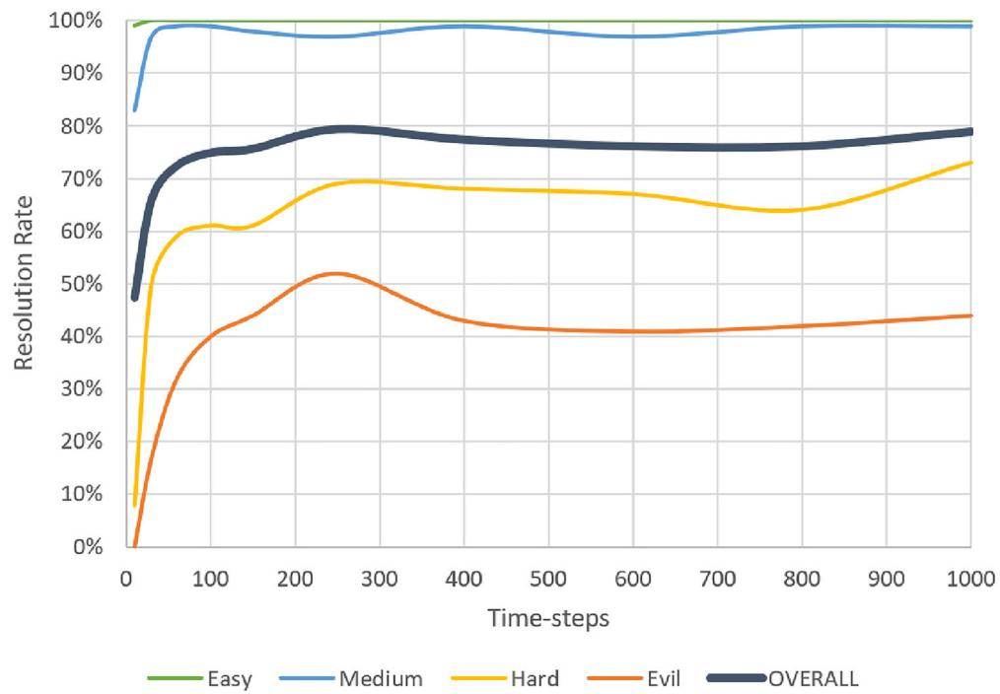

line

| Time-steps | Easy  | Medium | Hard  | Evil  | OVERALL |
| ---------- | ----- | ------ | ----- | ----- | ------- |
| 0          | 100%  | 83%    | 8%    | 0%    | 47%     |
| 100        | 100%  | 99%    | 61%   | 40%   | 75%     |
| 200        | 100%  | 98%    | 67%   | 52%   | 79%     |
| 300        | 100%  | 98%    | 70%   | 52%   | 79%     |
| 400        | 100%  | 98%    | 68%   | 43%   | 78%     |
| 500        | 100%  | 98%    | 68%   | 42%   | 77%     |
| 600        | 100%  | 98%    | 67%   | 42%   | 77%     |
| 700        | 100%  | 98%    | 65%   | 42%   | 77%     |
| 800        | 100%  | 98%    | 64%   | 43%   | 77%     |
| 900        | 100%  | 98%    | 68%   | 43%   | 78%     |
| 1000       | 100%  | 98%    | 73%   | 44%   | 79%     |

(a)

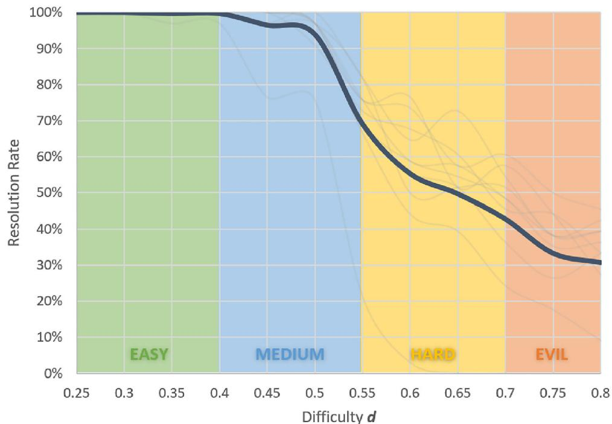

line

| Difficulty d | Resolution Rate |
| ------------ | --------------- |
| 0.25         | 100%            |
| 0.3          | 100%            |
| 0.35         | 100%            |
| 0.4          | 100%            |
| 0.45         | 98%             |
| 0.5          | 95%             |
| 0.55         | 70%             |
| 0.6          | 55%             |
| 0.65         | 50%             |
| 0.7          | 45%             |
| 0.75         | 35%             |
| 0.8          | 30%             |

(b)

#### 5.1.1 The impact of learning speed

As next steps, the impact of learning speed is analyzed based on the learning rates ratio best case \(( l _ { p } / l _ { r } = 2 0 )\) . Different learning speeds are considered and the results of the simulations based on penalty learning \(( l _ { p } )\) are presented in Fig. 7 for the 400 available set of puzzles under 250 maximum available time-steps. Figure 7a presents the resolution rate of the different difficulties of Sudoku puzzles for different speeds. As observed, the resolution rate

Fig. 6 a Resolution rate of 9  9 Sudoku puzzles of different difficulty levels under different learning rates \(( l _ { p } / l _ { r } )\) . b Overall resolution rate of \(9 \times 9\) Sudoku puzzles of different difficulty variables d as derived from simulations under learning rates \(( l _ { p } / l _ { r } )\) . Average resolution rate is presented in dark blue, while dotted line presents the resolution rate of the initial proposed algorithm   
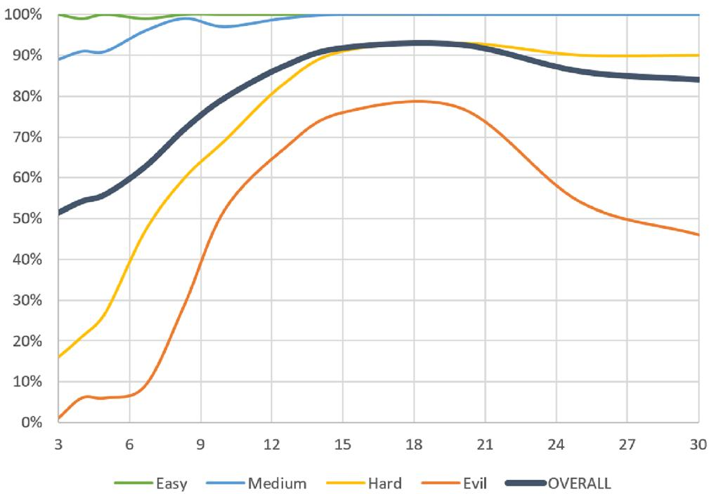

line

| x  | Easy  | Medium | Hard  | Evil  | OVERALL |
|----|-------|--------|-------|-------|---------|
| 3  | 100%  | 90%    | 15%   | 0%    | 50%     |
| 6  | 100%  | 95%    | 40%   | 5%    | 60%     |
| 9  | 100%  | 98%    | 65%   | 30%   | 75%     |
| 12 | 100%  | 99%    | 80%   | 65%   | 85%     |
| 15 | 100%  | 100%   | 90%   | 75%   | 92%     |
| 18 | 100%  | 100%   | 92%   | 78%   | 93%     |
| 21 | 100%  | 100%   | 91%   | 75%   | 92%     |
| 24 | 100%  | 100%   | 90%   | 60%   | 88%     |
| 27 | 100%  | 100%   | 90%   | 50%   | 85%     |
| 30 | 100%  | 100%   | 90%   | 45%   | 84%     |

(a)

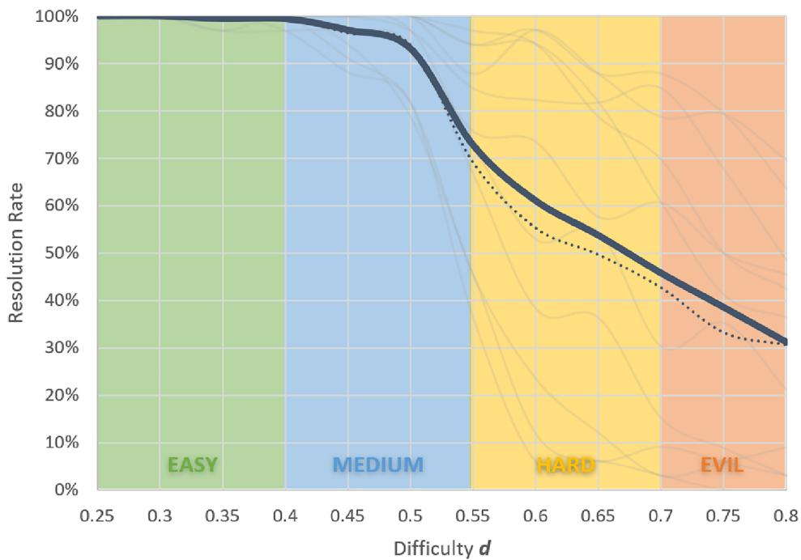

line

| Difficulty d | Resolution Rate |
| ------------ | --------------- |
| 0.25         | 100%            |
| 0.3          | 100%            |
| 0.35         | 100%            |
| 0.4          | 100%            |
| 0.45         | 98%             |
| 0.5          | 95%             |
| 0.55         | 75%             |
| 0.6          | 60%             |
| 0.65         | 55%             |
| 0.7          | 45%             |
| 0.75         | 35%             |
| 0.8          | 30%             |

(b)

Table 3 Resolution statistics for the best case of learning rates method \(( l _ { p } / l _ { r } = 2 0 )\) for Sudoku puzzles of different difficulties 

<table><tr><td>Difficulty</td><td>Resolution Rate</td><td>Average Time-steps</td><td>Perf. Improv from Table 2</td></tr><tr><td>Easy</td><td>100%</td><td>5</td><td>+0.1%</td></tr><tr><td>Medium</td><td>100%</td><td>13</td><td>+3.3%</td></tr><tr><td>Hard</td><td>93%</td><td>49</td><td>+35%</td></tr><tr><td>Evil</td><td>77%</td><td>95</td><td>+41.5%</td></tr><tr><td>Overall</td><td>92.5%</td><td>-</td><td>+20%</td></tr></table>

remains above 90% for slower speeds with the best case to be at \(l _ { p } = 3 . 5 ,\) , while for quicker speeds than the best one, the resolution rate drops significantly. The overall resolution rate of the best case is 96:3% (Table 4) with a slight increase of 3:8% to the performance of the learning rates algorithm, showcasing a 98% resolution rate for Hard puzzles (þ5%) and a 87% for Evil ones (þ10%). In Fig. 7b, the phase transition analysis is presented for the different difficulty variables \(d ,\) where it can be noticed that the different speeds have different impact on the resolution rate (presented in gray color), while the average one is slightly worse than the one from Sect. 5.1 (dotted line). It should be also noted that all the presented simulations under different learning rate ratios have been performed at slow speeds that do not affect the resolution rates and are above the critical point in which the algorithm underperforms.

Algorithm 3 Pseudo code of the selective probability reset rule

#### 5.2 Selective probability reset rule

In this method, a different rule is applied every specific amount of time-steps, namely sr time-steps, and, more specifically, the rule verifies if a row, column, or sub-grid has been resolved correctly or not in order to selectively reset the probability of its cells. It follows the Algorithm 1 with the exception that every sr time-steps, the Algorithm 3 is activated that incorporates the rule of the selective probability reset (lines 3-7). This rule has been selected from the fact that each row, column, and sub-grid should have all numbers from 1 to 9 exactly once (line 2), which means that the summation SN of all numbers in each row, column and sub-grid of each cell \(C _ { i , j }\) should comply with the following equation:

\[
\begin{array}{l} S N = \sum_ {C _ {k, l} \in N _ {i, j} ^ {c}} c _ {k, l} = \sum_ {C _ {k, l} \in N _ {i, j} ^ {r}} c _ {k, l} = \\ = \sum_ {C _ {k, l} \in N _ {i, j} ^ {\mathrm{sg}}} c _ {k, l} = \sum_ {c = 1} ^ {9} c = 4 5 \tag {10} \\ \end{array}
\]

Figure 8 illustrates the results of the simulations incorporating the selective probability reset rule every sr timesteps for the 400 available set of puzzles under 250 maximum available time-steps. The resolution rate of the different difficulties of Sudoku puzzles for the different sr time-steps can be spotted in Fig. 8a. It should be noted that the resolution rate can be improved significantly in comparison with the initial simulations when the selective reset rule provides enough time for the initial proposed algorithm to resolve the puzzles (i.e. sr [ 20). When the sr time-steps are getting increased significantly (i.e. sr [ 110) the reset rule is triggered fewer times and its impact on

1: for each cell \(C_{i,j}\) do
2: if \(\sum_{C_{k,l}\in N_{i,j}^{c}} c_{k,l} \neq SN\) or \(\sum_{C_{k,l}\in N_{i,j}^{r}} c_{k,l} \neq SN\) or \(\sum_{C_{k,l}\in N_{i,j}^{sg}} c_{k,l} \neq SN\) then
3: if \(P_{i,j}^{t}(c_{i,j}^{t}) > 0\) then
4: \(P_{i,j}^{t+1}(c_{i,j}^{t}) = 1\) 5: else
6: \(P_{i,j}^{t+1}(c_{i,j}^{t}) = 0\) 7: end if
8: end if
9: end for
10:
11: goto line 1

Fig. 7 a Resolution rate of 9  9 Sudoku puzzles of different difficulty levels under different learning speeds (based on \(l _ { p } )\) for fixed learning rates ratio \(( l _ { p } / l _ { r } = 2 0 )\) . b Overall resolution rate of \(9 \times 9\) Sudoku puzzles of different difficulty variables d as derived from simulations under learning speeds (based on \(l _ { p } )\) for fixed learning rates ratio \(( l _ { p } / l _ { r } = 2 0 )\) . Average resolution rate is presented in dark blue, while dotted line presents the resolution rate of the initial learning speed of Sect. 5.1   
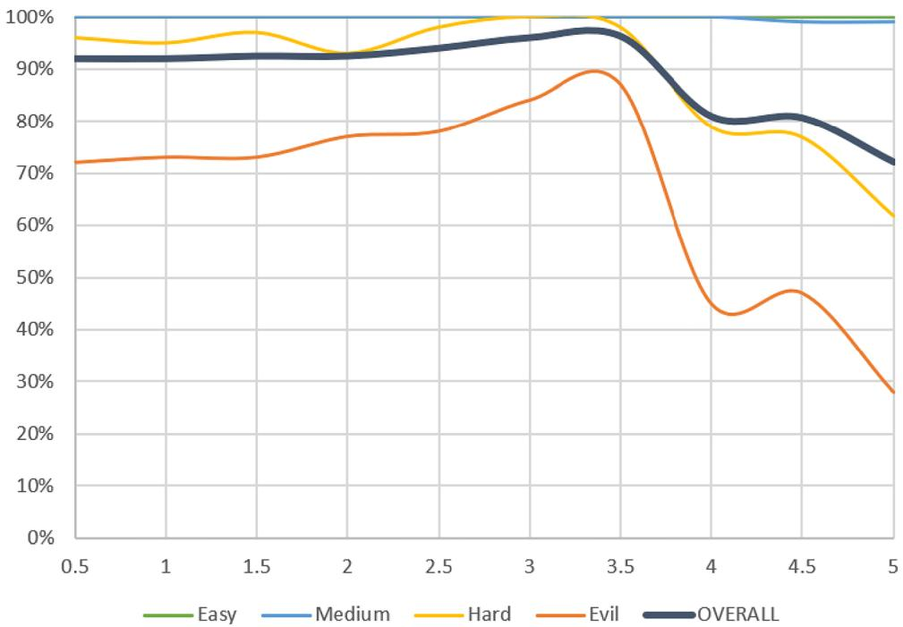

line

| x    | Easy  | Medium | Hard  | Evil  | OVERALL |
| ---- | ----- | ------ | ----- | ----- | ------- |
| 0.5  | 100%  | 100%   | 95%   | 72%   | 92%     |
| 1.0  | 100%  | 100%   | 96%   | 73%   | 92%     |
| 1.5  | 100%  | 100%   | 97%   | 73%   | 92%     |
| 2.0  | 100%  | 100%   | 92%   | 77%   | 93%     |
| 2.5  | 100%  | 100%   | 98%   | 78%   | 94%     |
| 3.0  | 100%  | 100%   | 100%  | 85%   | 96%     |
| 3.5  | 100%  | 100%   | 100%  | 90%   | 97%     |
| 4.0  | 100%  | 100%   | 80%   | 43%   | 81%     |
| 4.5  | 100%  | 100%   | 78%   | 47%   | 82%     |
| 5.0  | 100%  | 100%   | 62%   | 28%   | 72%     |

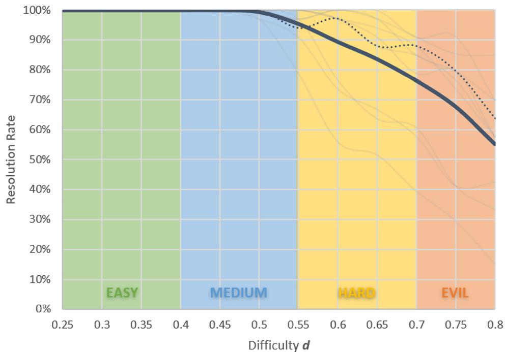

line

| Difficulty d | Resolution Rate |
| ------------ | --------------- |
| 0.25         | 100%            |
| 0.3          | 100%            |
| 0.35         | 100%            |
| 0.4          | 100%            |
| 0.45         | 100%            |
| 0.5          | 98%             |
| 0.55         | 95%             |
| 0.6          | 90%             |
| 0.65         | 85%             |
| 0.7          | 80%             |
| 0.75         | 75%             |
| 0.8          | 55%             |

(b)

Table 4 Resolution statistics for the best case of learning speed \(( l _ { p } = 3 . 5 )\) ) for Sudoku puzzles of different difficulties 

<table><tr><td>Difficulty</td><td>Resolution Rate</td><td>Average Time-steps</td><td>Perf. Improv from Table 3</td></tr><tr><td>Easy</td><td>100%</td><td>5</td><td>-</td></tr><tr><td>Medium</td><td>100%</td><td>17</td><td>-</td></tr><tr><td>Hard</td><td>98%</td><td>78</td><td>+5%</td></tr><tr><td>Evil</td><td>87%</td><td>109</td><td>+10%</td></tr><tr><td>Overall</td><td>96.3%</td><td>-</td><td>+3.8%</td></tr></table>

resolution rate improvement drops towards the resolution rates without this rule (dotted lines after \(s r = 1 3 0 )\) . The overall resolution rate of the best case (sr ¼ 40) reaches 98:8% (Table 5) with an increase of 26:3% in comparison to the initial performance showcasing a 99% resolution rate for Hard puzzles (þ41%) and a 96% for Evil ones (þ60:5%). In Fig. 8b, the phase transition analysis is presented for the different difficulty variables \(d ,\) where it can be observed that, similarly to the previous method, different amount of sr time-steps for the selective rule (presented in gray color) have different impact to the resolution rate, while the initial proposed algorithm (dotted line) exhibits remarkably lower resolution rate than the average one of this method.

#### 5.3 Methods combination

Both presented performance enhancement methods showcase an improvement to the overall resolution rate results of the initial proposed algorithm. However, it should be investigated if the combination of both methods can provide even better results. Simulations have taken place for all possible combinations that were investigated in Sects. 5.1 and 5.2 for the 400 available set of puzzles under 250 maximum available time-steps.

The results are presented in Figs. 9 and 10 for each different difficulty level. Different resolution levels can be spotted under different color codes, where the following convention for the resolution characterization is considered:

• Very Low: ½0%; 24%Þ presented in blue color   
• Low: ½24%; 48%Þ presented in orange color   
• Average: ½48%; 72%Þ presented in gray color   
• Good: ½72%; 96%Þ presented in yellow color   
• Excellent: ½96%; 100% presented in green color

As can be observed in Figs. 9a and 10a, the overall resolution rate can be characterized as Good and Excellent in the greatest part of the plot, while the highest resolution rate was 99:3% in case of \(l _ { p } / l _ { r } = 1 5\) and \(s r = 6 5\) (Table 6). For Easy and Medium difficulty puzzles the resolution rate remains at excellent levels in almost all cases hitting 100% most of the time (Figs. 9b–c and 10b–c). In Figs. 9d and 10d, the High difficulty puzzles results are presented and it can be observed that there is a countable area where there is an excellent resolution rate achieving 100% for the best case of \(l _ { p } / l _ { r } = 1 5\) and \(s r = 5 0\) (Table 6). Lastly, Evil puzzles showcase a Good solubility (Figs. 9e and 10e), while in their best case are 98% solved using \(l _ { p } / l _ { r } = 1 5\) and \(s r = 6 5\) (Table 6).

#### 6 Conclusion

In this paper, we report an ILCA algorithm for the resolution of Sudoku puzzles which combines the spatial and temporal evolution of CA with the learning mechanisms of \(\mathrm { L A } .\) The algorithm is based on the reward and penalty strategy and utilizes the degree of the grid’s cells for its evolution. For the initialization, the pre-defined cells were assigned 100% probability to their pre-defined numbers, and at the same time, they affected the probability of their neighbors accordingly.

It has been observed that the algorithm is able to provide a solution in a few time-steps. It has been tested in a range of 400 puzzles of different difficulty levels, achieving a 72:5% resolution rate. In order to improve the performance of the algorithm, two methods were proposed; the learning rates method and the selective probability reset rule. The first method introduced learning rate variables during the reward and penalty process, while the second one used a different rule for every specific number of time-steps to reset the probability of the cells that couldn’t reach a solution.

Both methods were able to improve the results of the algorithm, reaching a 92:5% and a 98:8% resolution rate respectively. The combination of these methods was also examined in order to determine if the results could further be improved. A 99:3% resolution rate was achieved when combining the two methods, while all easy, medium, and hard puzzles and 98% of evil ones were resolved.

The proposed algorithm has shown promising results in dealing with complex logic puzzles, i.e. Sudoku puzzles, showing a potential towards getting extended to other similar puzzles. At the same time, it could tentatively be adapted accordingly, so as to generate Sudoku puzzles by incorporating modifications such as removing the initialization process and by adding a selection process that will reduce the solutions space progressively to finally generate a random puzzle.

Fig. 8 a Resolution rate of 9  9 Sudoku puzzles of different difficulty levels incorporating the selective probability reset rule. b Overall resolution rate of 9  9 Sudoku puzzles of different difficulty variables d as derived from simulations incorporating the selective probability reset rule. Average resolution rate is presented in dark blue, while dotted line presents the resolution rate of the initial proposed algorithm   
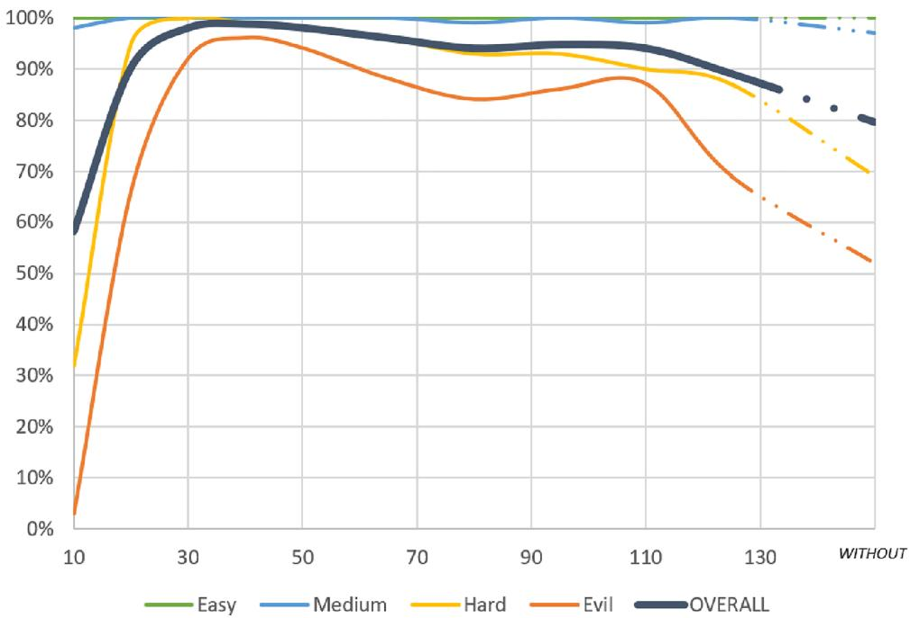

line

| X Value | Easy | Medium | Hard | Evil | OVERALL |
| ------- | ---- | ------ | ---- | ---- | ------- |
| 10      | 100% | 100%   | 30%  | 0%   | 60%     |
| 30      | 100% | 100%   | 100% | 95%  | 98%     |
| 50      | 100% | 100%   | 100% | 95%  | 98%     |
| 70      | 100% | 100%   | 95%  | 85%  | 95%     |
| 90      | 100% | 100%   | 95%  | 85%  | 95%     |
| 110     | 100% | 100%   | 90%  | 88%  | 95%     |
| 130     | 100% | 100%   | 85%  | 65%  | 85%     |
| WITHOUT  | 100% | 100%   | 70%  | 52%  | 80%     |

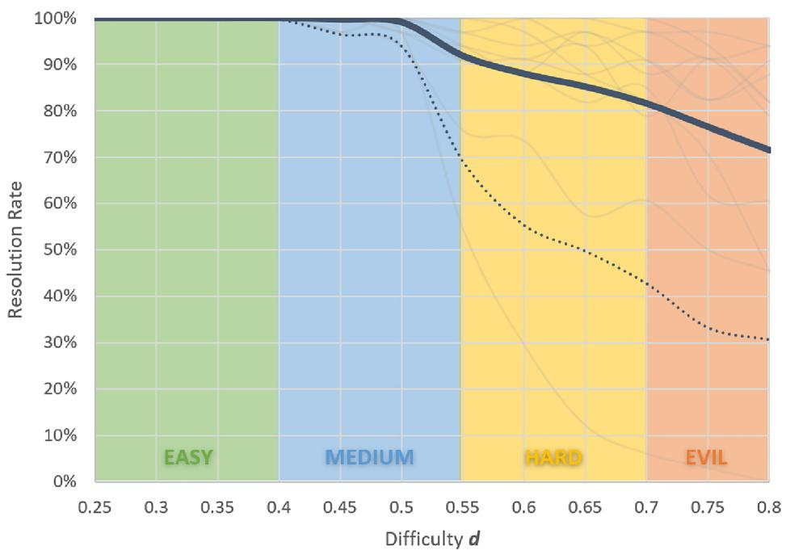

line

| Difficulty d | Resolution Rate |
| ------------ | --------------- |
| 0.25         | 100%            |
| 0.3          | 100%            |
| 0.35         | 100%            |
| 0.4          | 100%            |
| 0.45         | 98%             |
| 0.5          | 95%             |
| 0.55         | 70%             |
| 0.6          | 55%             |
| 0.65         | 50%             |
| 0.7          | 45%             |
| 0.75         | 35%             |
| 0.8          | 30%             |

(b)

Table 5 Resolution statistics for the best case of the selective probability reset rule method \(( s r = 4 0 )\) for Sudoku puzzles of different difficulties 

<table><tr><td>Difficulty</td><td>Resolution Rate</td><td>Average Time-steps</td><td>Perf. Improv from Table 2</td></tr><tr><td>Easy</td><td>100%</td><td>6</td><td>+0.1%</td></tr><tr><td>Medium</td><td>100%</td><td>26</td><td>+3.3%</td></tr><tr><td>Hard</td><td>99%</td><td>91</td><td>+41%</td></tr><tr><td>Evil</td><td>96%</td><td>121</td><td>+60.5%</td></tr><tr><td>Overall</td><td>98.8%</td><td>-</td><td>+26.3%</td></tr></table>

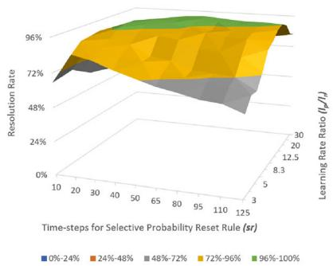

area_stacked

| Time-steps for Selective Probability Reset Rule (sr) | Resolution Rate | Learning Rate Ratio (I_r/I_r) |
| -------------------------------------------------- | --------------- | ----------------------------- |
| 10                                                 | 0%              | 0                             |
| 20                                                 | 24%             | 5                             |
| 30                                                 | 48%             | 10                            |
| 40                                                 | 72%             | 15                            |
| 50                                                 | 96%             | 20                            |
| 60                                                 | 96%             | 25                            |
| 70                                                 | 96%             | 30                            |
| 80                                                 | 96%             | 35                            |
| 90                                                 | 96%             | 40                            |
| 100                                                | 96%             | 45                            |
| 110                                                | 96%             | 50                            |
| 120                                                | 96%             | 55                            |
| 130                                                | 96%             | 60                            |
| 140                                                | 96%             | 65                            |
| 150                                                | 96%             | 70                            |
| 160                                                | 96%             | 75                            |
| 170                                                | 96%             | 80                            |
| 180                                                | 96%             | 85                            |
| 190                                                | 96%             | 90                            |
| 200                                                | 96%             | 95                            |
| Note: The data is presented in a CSV format with three columns: 'Time-steps' and 'Resolution Rate'. The 'Learning Rate Ratio' values are also provided in the table above. There is only one data series in this case. |                  |                               |

(aOverall

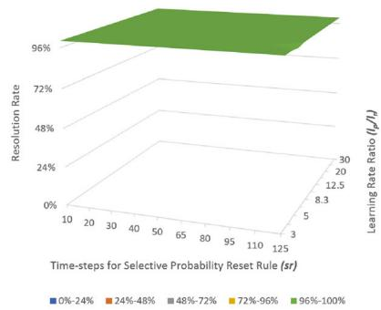

area_stacked

| Time-steps for Selective Probability Reset Rule (sr) | Resolution Rate | Learning Rate Ratio (f_s / f_a) |
| -------------------------------------------------- | --------------- | ------------------------------ |
| 0%                                                 | 0%              | 5                              |
| 24%                                                | 24%             | 8.3                            |
| 48%                                                | 48%             | 12.5                           |
| 72%                                                | 72%             | 18.3                           |
| 96%                                                | 96%             | 24.0                           |

() Easy

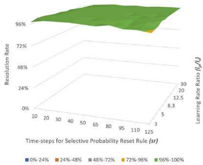

surface_3d

| Time-steps for Selective Probability Reset Rule (sr) | Resolution Rate | Learning Rate Ratio (I_p / I_f) |
| -------------------------------------------------- | --------------- | ------------------------------- |
| 10                                                 | 0%              | 0                               |
| 20                                                 | 24%             | 5                               |
| 30                                                 | 48%             | 10                              |
| 40                                                 | 72%             | 15                              |
| 50                                                 | 96%             | 20                              |
| 60                                                 | 96%             | 25                              |
| 70                                                 | 96%             | 30                              |
| 80                                                 | 96%             | 30                              |
| 90                                                 | 96%             | 30                              |
| 100                                                | 96%             | 30                              |
| 110                                                | 96%             | 30                              |
| 120                                                | 96%             | 30                              |
| 125                                                | 96%             | 30                              |
| 125                                                | 12.5            | 30                              |
| 125                                                | 18.3            | 30                              |
| 125                                                | 24.0            | 30                              |
| 125                                                | 30.0            | 30                              |

Medium

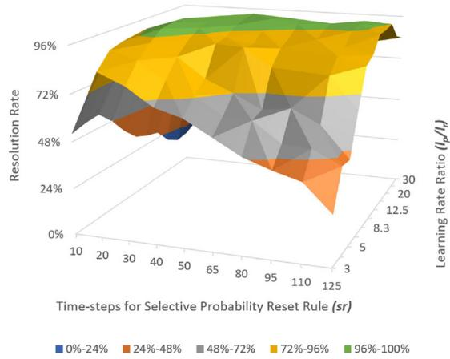

area_stacked

| Time-steps for Selective Probability Reset Rule (sr) | Resolution Rate | Learning Rate Ratio (I_p/I_μ) |
| -------------------------------------------------- | --------------- | ----------------------------- |
| 10                                                 | 0%              | 30                            |
| 20                                                 | 24%             | 20                            |
| 30                                                 | 48%             | 12.5                          |
| 40                                                 | 72%             | 8.3                           |
| 50                                                 | 96%             | 5                             |
| 60                                                 | 96%             | 3                             |
| 70                                                 | 96%             | 2                             |
| 80                                                 | 96%             | 1                             |
| 90                                                 | 96%             | 0.5                           |
| 100                                                | 96%             | 0.3                           |
| 110                                                | 96%             | 0.2                           |
| 120                                                | 96%             | 0.1                           |
| 125                                                | 96%             | 0.05                          |

Hard

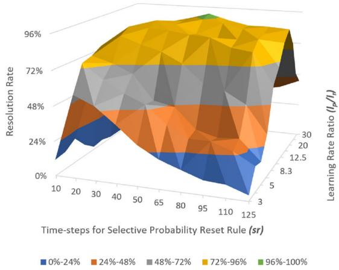

area_stacked

| Time-steps | Resolution Rate | Learning Rate Ratio (I_p/I_d) |
| ---------- | --------------- | ----------------------------- |
| 10         | 0%              | 0.3                           |
| 20         | 24%             | 1.2                           |
| 30         | 48%             | 2.0                           |
| 40         | 72%             | 2.8                           |
| 50         | 96%             | 3.5                           |
| 65         | 96%             | 3.8                           |
| 80         | 96%             | 3.9                           |
| 95         | 96%             | 4.0                           |
| 110        | 96%             | 4.1                           |
| 125        | 96%             | 4.2                           |

Evil   
Fig. 9 Surface plots of resolution rates for \(9 \times 9\) Sudoku puzzles using the proposed algorithm along with a combination of the performance enhancement methods

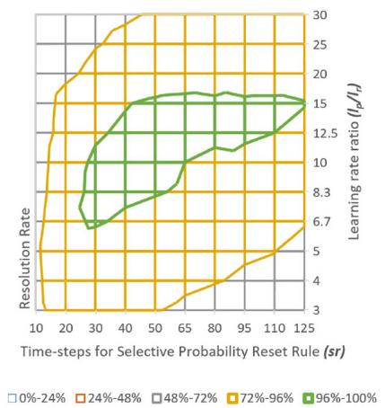

line

| Time-steps | Resolution Rate | Learning rate ratio (I_r/I_r) |
| ---------- | --------------- | ----------------------------- |
| 10         | 3               | 3                             |
| 20         | 15              | 15                            |
| 30         | 25              | 25                            |
| 40         | 28              | 28                            |
| 50         | 25              | 25                            |
| 60         | 15              | 15                            |
| 70         | 12.5            | 12.5                          |
| 80         | 15              | 15                            |
| 90         | 15              | 15                            |
| 100        | 15              | 15                            |
| 110        | 15              | 15                            |
| 120        | 15              | 15                            |
| 125        | 15              | 15                            |

(a)Overall

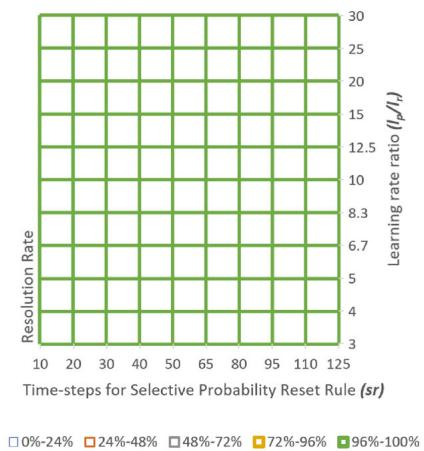

line

| Time-steps for Selective Probability Reset Rule (sr) | Learning rate ratio (I_r/I_r) |
| -------------------------------------------------- | ----------------------------- |
| 10                                                 | 3                             |
| 20                                                 | 3                             |
| 30                                                 | 3                             |
| 40                                                 | 3                             |
| 50                                                 | 3                             |
| 60                                                 | 3                             |
| 70                                                 | 3                             |
| 80                                                 | 3                             |
| 90                                                 | 3                             |
| 100                                                | 3                             |
| 110                                                | 3                             |
| 120                                                | 3                             |
| 125                                                | 3                             |

(b) Easy

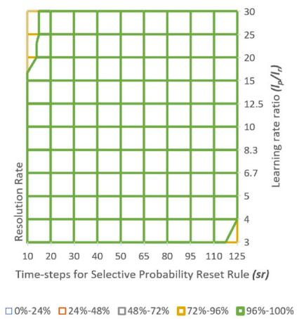

line

| Time-steps | Learning rate ratio (I_p/I_1) |
| ---------- | ----------------------------- |
| 10         | 30                            |
| 125        | 3                             |

Medium

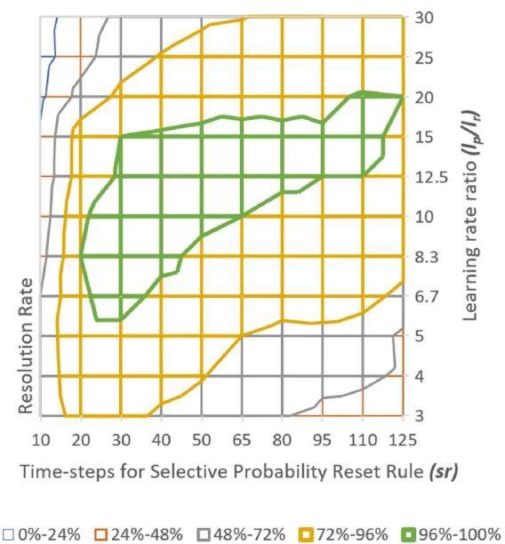

line

| Time-steps | 0%-24% | 24%-48% | 48%-72% | 72%-96% | 96%-100% |
| ---------- | ------ | ------- | ------- | ------- | -------- |
| 10         | 30     | 30      | 30      | 30      | 30       |
| 20         | 30     | 30      | 30      | 30      | 30       |
| 30         | 30     | 30      | 30      | 30      | 30       |
| 40         | 30     | 30      | 30      | 30      | 30       |
| 50         | 30     | 30      | 30      | 30      | 30       |
| 65         | 30     | 30      | 30      | 30      | 30       |
| 80         | 30     | 30      | 30      | 30      | 30       |
| 95         | 30     | 30      | 30      | 30      | 30       |
| 110        | 30     | 30      | 30      | 30      | 30       |
| 125        | 30     | 30      | 30      | 30      | 30       |

Hard

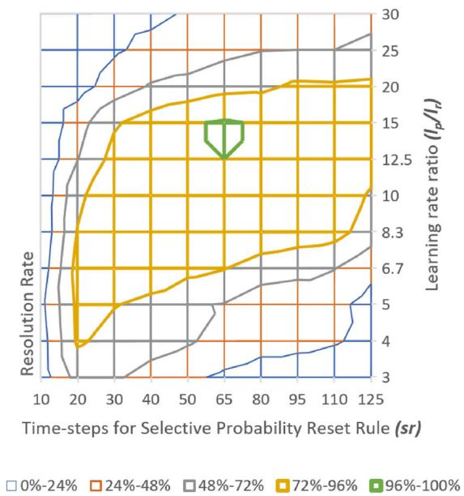

line

| Time-steps | Resolution Rate | Learning rate ratio (I_p/I_t) |
| ---------- | --------------- | ----------------------------- |
| 10         | 3               | 3                             |
| 20         | 4               | 4                             |
| 30         | 5               | 5                             |
| 40         | 6               | 6                             |
| 50         | 7               | 7                             |
| 65         | 8               | 8                             |
| 80         | 9               | 9                             |
| 95         | 10              | 10                            |
| 110        | 11              | 11                            |
| 125        | 12              | 12                            |

( Evil

Fig. 10 Contour plots of resolution rates for 9  9 Sudoku puzzles using the proposed algorithm along with a combination of the performance enhancement methods   
Table 6 Best case resolution statistics of a combination of the performance enhancement methods for Sudoku puzzles of different difficulties 

<table><tr><td rowspan="2">Difficulty</td><td colspan="2">Best  \(Case^1\) </td><td rowspan="2">Resolution Rate</td><td rowspan="2">Average Time-steps</td><td colspan="3">Performance Improvement from</td></tr><tr><td> \(l_p/l_r\) </td><td>sr</td><td>Table 2</td><td>Table 3</td><td>Table 5</td></tr><tr><td>Easy</td><td>various</td><td></td><td>100%</td><td>5</td><td>+0.1%</td><td>-</td><td>-</td></tr><tr><td>Medium</td><td>15</td><td>-</td><td>100%</td><td>12</td><td>+3.3%</td><td>-</td><td>-</td></tr><tr><td>Hard</td><td>15</td><td>50</td><td>100%</td><td>78</td><td>+42%</td><td>+7%</td><td>+1%</td></tr><tr><td>Evil</td><td>15</td><td>65</td><td>98%</td><td>114</td><td>+62.5%</td><td>+21%</td><td>+2%</td></tr><tr><td>Overall</td><td>15</td><td>65</td><td>99.3%</td><td>-</td><td>+26.8%</td><td>+6.8%</td><td>+0.5%</td></tr></table>

1 Best case is considered the one with firstly the highest resolution rate, and secondly the lowest average time-steps

In future work, the applicability of the algorithm to the Sudoku alternatives will be investigated, and the necessary modifications will be performed in order to utilize it for a wider range of complex logic puzzles, as well as for puzzle generation procedures. Furthermore, the expansion of the algorithm to everyday problems that require similar processes to Sudoku resolution will be studied. Lastly, a hardware implementation of the proposed algorithm will be investigated utilizing unconventional parallel computing systems such as memristive computing grids.

Author Contributions All authors contributed equally to the study conception and design, the material preparation, data collection and analysis, and the manuscript writing and editing. All authors read and approved the final manuscript.

Funding Open access funding provided by HEAL-Link Greece. This work has been supported by the Hellenic Foundation for Research and Innovation (H.F.R.I.) under the ‘‘First Call for H.F.R.I. Research Projects to support Faculty members and Researchers and the procurement of high-cost research equipment grant’’ (Project Number: 3830).

Data Availability The datasets generated during and/or analysed during the current study are available from the corresponding author on reasonable request.

#### Declarations

Conflict of interest The authors have no competing interests to declare that are relevant to the content of this article.

Ethical approval Not applicable.

Open Access This article is licensed under a Creative Commons Attribution 4.0 International License, which permits use, sharing, adaptation, distribution and reproduction in any medium or format, as long as you give appropriate credit to the original author(s) and the source, provide a link to the Creative Commons licence, and indicate if changes were made. The images or other third party material in this article are included in the article’s Creative Commons licence, unless indicated otherwise in a credit line to the material. If material is not included in the article’s Creative Commons licence and your intended use is not permitted by statutory regulation or exceeds the permitted use, you will need to obtain permission directly from the copyright holder. To view a copy of this licence, visit http://creativecommons. org/licenses/by/4.0/.

#### References

Ahangaran M, Taghizadeh N, Beigy H (2017) Associative cellular learning automata and its applications. Appl Soft Comput 53:1–18   
Brooker H, Wesnes KA, Ballard C et al (2019) The relationship between the frequency of number-puzzle use and baseline cognitive function in a large online sample of adults aged 50 and over. Int J Geriatr Psychiatry 34(7):932–940

Chatzinikolaou TP, Fyrigos IA, Karamani RE, et al (2020) Memristive oscillatory circuits for resolution of np-complete logic puzzles: Sudoku case. In: 2020 ISCAS, pp 1–5   
Chatzinikolaou TP, Karamani RE, Sirakoulis GC (2022) Irregular learning cellular automata for the resolution of complex logic puzzles. In: Chopard B, Bandini S, Dennunzio A, et al (eds) Cellular Automata. Springer International Publishing, pp 356–367   
Chien YF, Hon WK (2010) Cryptographic and physical zeroknowledge proof: from sudoku to nonogram. In: Boldi P, Gargano L (eds) Fun with Algorithms. Springer, Berlin Heidelberg, Berlin, Heidelberg, pp 102–112   
Chong Leung JY, Lui WS, Lee TM (2014) The application of graph theory to sudoku. Honorable Mention, Hang Lung Mathematics Awards, Vol. 6   
Chopard B, Droz M (1998) Cellular automata modeling of physical systems. Collection Alea-Saclay: Monographs and Texts in Statistical Physics. Cambridge University Press   
Chopard B, Tomassini M (2018) An introduction to metaheuristics for optimization. Springer, New york   
Delahaye JP (2006) The science behind Sudoku. Sci Am 294(6):80–87   
Dourvas NI, Sirakoulis GC, Adamatzky AI (2019) Parallel accelerated virtual physarum lab based on cellular automata agents. IEEE Access 7:98,306-98,318   
Ercsey-Ravasz M, Toroczkai Z (2012) The chaos within sudoku. Sci Rep 2(1):725   
Grabbe JW (2017) Sudoku and changes in working memory performance for older adults and younger adults. Activi Adaptat Aging 41(1):14–21   
Hufkens LV, Browne C (2019) A functional taxonomy of logic puzzles. In: 2019 IEEE Conference on Games (CoG), IEEE, pp 1–4   
Ioannidis K, Sirakoulis GC, Andreadis I (2008) A cellular automaton collision-free path planner suitable for cooperative robots. In: 2008 Panhellenic conference on informatics, pp 256–260   
Jana S, Dey A, Maji AK et al (2021) A novel hybrid genetic algorithm-based firefly mating algorithm for solving sudoku. Innovations Syst Softw Eng 17(3):261–275   
Jiang W, Li B, Li S et al (2016) A new prospective for learning automata: a machine learning approach. Neurocomputing 188:319–325   
Karamani RE, Fyrigos IA, Tsakalos KA et al (2021) Memristive learning cellular automata for edge detection. Chaos Solitons Fractals 145(110):700   
Lewis R (2007) Metaheuristics can solve sudoku puzzles. J Heurist 13(4):387–401   
Lynce I, Ouaknine J (2006) Sudoku as a sat problem. ISAIM 11(1):6–13   
Manikandan C, Satwik KSS, Smarani TM et al (2021) A combined sudoku and synthetic colour image techniques for cryptographic key generation. J Phys Conf Ser 1767(1):012,050   
Mantere T, Koljonen J (2007) Solving, rating and generating sudoku puzzles with GA. In: 2007 IEEE congress on evolutionary computation, pp 1382–1389   
Mitsopoulou M, Dourvas NI, Sirakoulis GC et al (2019) Spatial games and memory effects on crowd evacuation behavior with cellular automata. J. Comput. Sci. 32:87–98   
Mozafari M, Shiri ME, Beigy H (2015) A cooperative learning method based on cellular learning automata and its application in optimization problems. J. Comput. Sci. 11:279–288   
Narendra KS, Thathachar MAL (1974) Learning automata—a survey. IEEE Trans Syst Man Cybern SMC 4(4):323–334   
Neumann JV (1966) Theory of Self-Reproducing Automata. University of Illinois Press, illinois

Pacurib JA, Seno GMM, Yusiong JPT (2009) Solving sudoku puzzles using improved artificial bee colony algorithm. In: ICICIC 2009, IEEE, pp 885–888   
Russell E, Jarvis F (2006) Mathematics of Sudoku II. Math Spectr 39(2):54–58   
Simonis H (2005) Sudoku as a constraint problem. In: CP Workshop on modeling and reformulating constraint satisfaction problems, Citeseer, pp 13–27   
Soto R, Crawford B, Galleguillos C et al (2015) A filtering technique for helping to solve sudoku problems. In: Stephanidis C (ed) HCI International 2015—Posters’ Extended Abstracts. Springer International Publishing, Cham, pp 598–603   
Torkestani JA, Meybodi MR (2011) A cellular learning automatabased algorithm for solving the vertex coloring problem. Expert Syst Appl 38(8):9237–9247   
Tsompanas MAI, Dourvas NI, Ioannidis K, et al (2018) Cellular Automata Applications in Shortest Path Problem, vol 32, Springer International Publishing, p 199

Vamsi KS, Gangadharabhotla S, Sai VSH (2021) A deep learning approach to solve sudoku puzzle. In: 2021 ICICCS, IEEE, pp 1175–1179   
Van Der Bok K, Taouil M, Afratis P, et al (2009) The TU Delft sudoku solver on FPGA. In: 2009 international conference on field-programmable technology, IEEE, pp 526–529   
Weaver C (2020) Strategies and algorithms of sudoku. Mathematics Senior Capstone Papers 22   
Wolfram S (2018) Cellular automata and complexity: collected papers. crc Press, Boca Raton   
Yato T, Seta T (2003) Complexity and completeness of finding another solution and its application to puzzles. IEICE Trans Fundam Electron Commun Comput Sci 86(5):1052–1060

Publisher’s Note Springer Nature remains neutral with regard to jurisdictional claims in published maps and institutional affiliations.